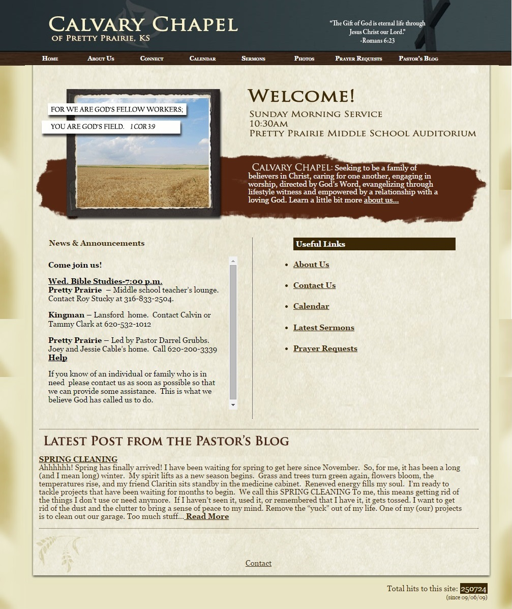
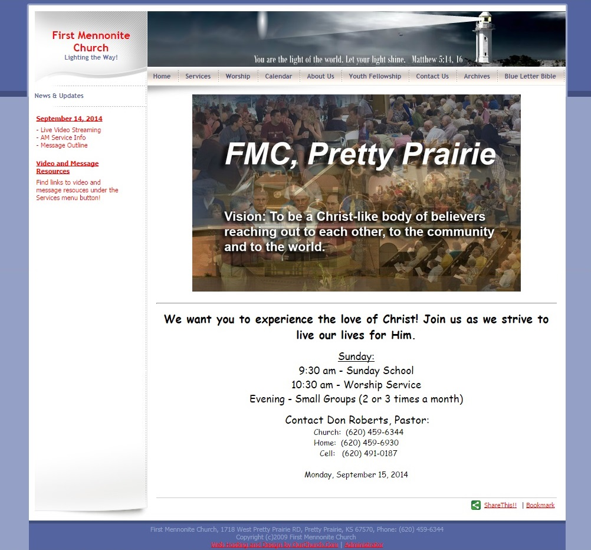
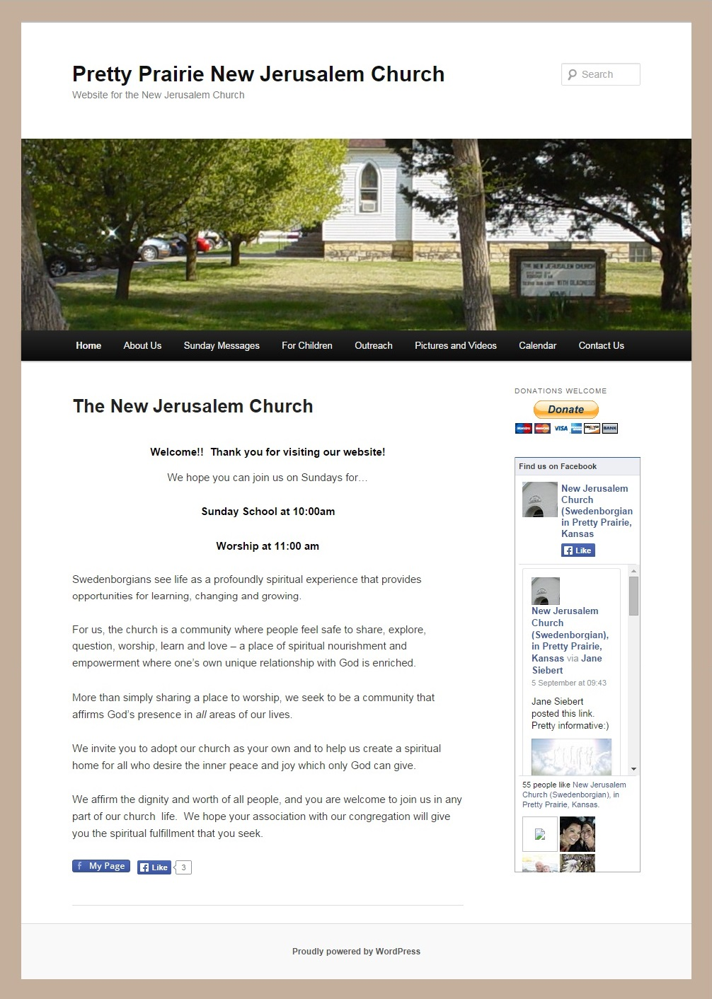

# Other Area Churches

When considering web hosting options, it was helpful to look at the websites of other area churches (see below) to see what web hosts and functionality are popular among other churches in the same demographic.

Notably, New Jerusalem Church is using the very popular WordPress [Twenty Eleven](https://wordpress.org/themes/twentyeleven) theme. I also considered this template for Pretty Prairie United Methodist Church because the national United Methodist Church offers this template as part of its hosting platform. But, I decided to forgo it in order to have something unique to the church. 

Calvary Chapel:

 
First Mennonite Church:

 
New Jerusalem Church:

