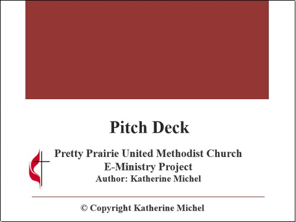
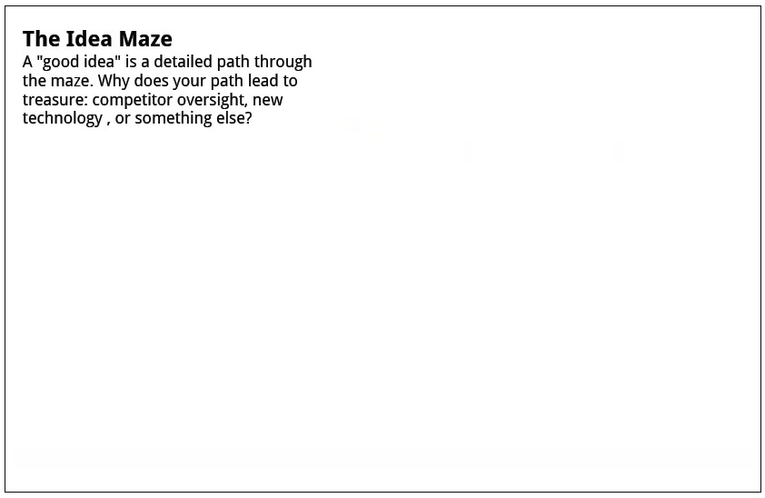
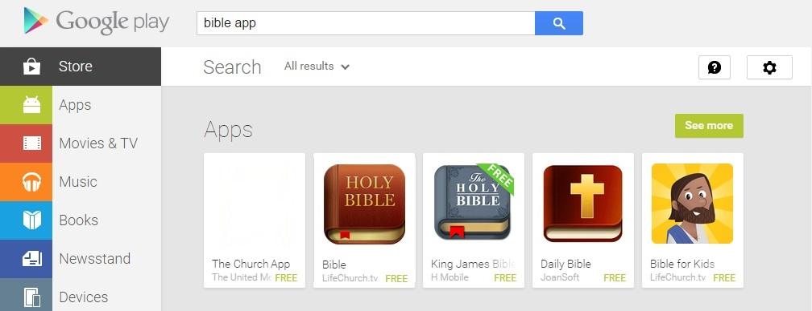
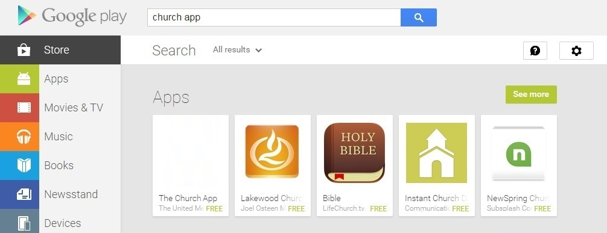
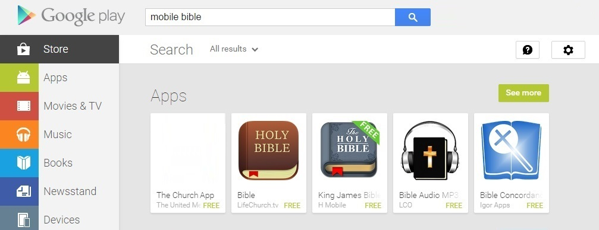
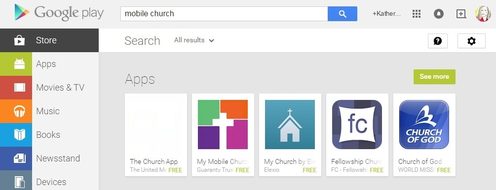
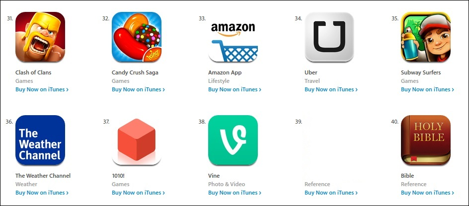
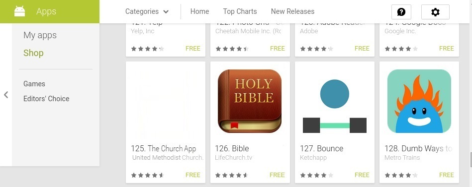

# Pitch

## Church Re-Imagined App

See [LifeChurch and The Bible App Case Study](lifechurch_and_the_bible_app_case_study.md) and [Prototype](prototype.md) for the inspiration for this pitch.

## Pitch Slide Deck

## Deal Structure

### Corporate Structure Options
| Corporate Entity | Description |
| -- | -- |
| [Non-profit](http://en.wikipedia.org/wiki/Nonprofit_organization) | Traditional charity |
| [B corporation](http://en.wikipedia.org/wiki/Benefit_corporation) | Special category of for-profit |

## Likely Funding
Where will the startup funding come from?

| Funding Option | Source |
| -- | -- |
| Seed money | Donations |

## Possible Business Models
How will the organization make money? How will the product/service be priced? Will there be multiple revenue streams?

| Business Model | Notes |
| -- | -- |
| Donations | Is this self-sustaining? |
| Freemium | Supported through in-app purchases, ads, ect. |
| Limited Freemium | Free for a year then $ .99 |
| Paid | Potential users may be excluded |
| Price based on OS | Different operating systems generate different amounts of revenue |

The suggested business model would be freemium with support through donations, in-app purchases, and limited ads/partnerships.

## Cost Structure

### Cost to Produce/Deliver

### Cost to Reach New Users
Time/resources

### Customer Support Costs

## Key Partners

## Key Suppliers

## Key Resources

## Key Activities

[Economics are the Future of Charity](https://chartio.com/blog/2015/03/saas-economics-are-the-future-of-charity)

### Market Size
Currently, United Methodist membership is steadily falling in the United States, but dramatically rising in certain developing countries. However, the app would be creating a new market. 

## Competitive Analysis

According to Pew Research, churches are a highly competitive marketplace. 

### Idea Maze
Placeholder

Who are competitors? 
* Other traditional Mainline churches
* Contemporary churches such as LifeChurch

### Network Effect
Building the app is not the only challenge. A network effect also needs to be created. This is where a missed opportunity exists. The United Methodist Church would not be starting from scratch to build up a user base. A potential user base of 12 million United Methodist members already exists, not to mention casual church-goers, newcomers, and those unaffilitated with the United Methodist Church. The United Methodist Church could start by promoting the app to its own member base. 

In the book Zero-to-One, Peter Thiel recommends dominating a small market first, then expanding vertically. 

### Primary Users Segmentation

| Region | Approximate Number of United Methodist Members |
| -- | -- |
| U.S. | 7,725,039 |
| Non-U.S. | 4,000,000 |
| Total Worldwide | 12,000,000 |

| Region | Approximate Number of Congregations |
| -- | -- |
| Worldwide | 34,892 |

### User Acquisition
Who to target and how?

* World population: ~7 billion
* Number of Christians: 
* Number of non-United Methodist Christians: 
* Number of non-Christians
* Number of people with no religions affiliation:
* Number of people with internet: 
* Number of people with desktop computers:
* Number of people with mobile phones:

## Information Capture
Global database

## Talent
The app would need to be built by people of the right skill level. They could be recruited from:

* Staff
* Third party business
* Volunteers
* Contest entries

### Objectives and key Results (OKRs)
[OKR Wikipedia](http://en.wikipedia.org/wiki/OKR)

[How Google Set Goals: Objectives and Key Results](https://www.gv.com/lib/how-google-sets-goals-objectives-and-key-results-okrs)

## Platforms

## Home Screen
Goal: occupy high value real estate on home screens

## Google Search (Search Engine Optimization/SEO)
Goal: be number 1 search result in search engines for relevant keyword searches

## App Stores
Goal: be number 1 search result in app stores for relevant keyword searches

### Google Play Store (Android)
Also, Google Play Store by country
#### Search 'Bible app'
Number 1 search result

#### Search 'church app'
Number 1 search result

#### Search 'mobile Bible'
Number 1 search result

#### Search 'mobile church'
Number 1 search result

### Free App Rankings
Goal: have "Free App" rankings comparable to The Bible App in Apple iTunes Store and Google Play Store

#### Apple iTunes Store
Ranking comparable to The Bible App

#### Google Play Store (Android)
Ranking comparable to The Bible App

### Website, Facebook, Twitter (tweets, retweets, intents), Pinterest, Instagram profiles

### Google+ and Rich Snippet

### Google Ad

### Facebook Ad

### Twitter Ad

### Facebook OpenGraph

### Twitter Card

