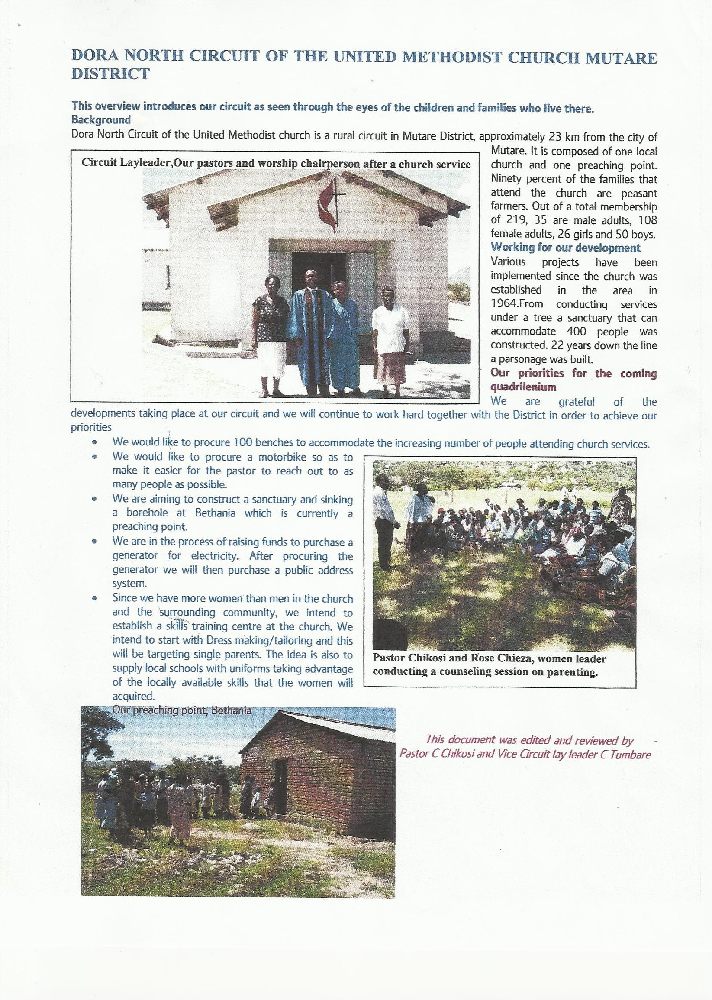

# Pitch

## Church Re-Imagined App

See [LifeChurch and The Bible App Case Study](lifechurch_and_the_bible_app_case_study.md) and [Prototype](prototype.md) for the inspiration for this pitch.

This pitch was created using [Sten Tamkivi's Toolkit for Evaluating a New Venture](https://medium.com/@seikatsu/toolkit-for-evaluating-a-new-venture-c6ee623a4bca), [The Business Model Canvas](http://www.businessmodelgeneration.com/downloads/business_model_canvas_poster.pdf), and [The U.S. CIO Playbook](http://playbook.cio.gov)

## Reverse Engineering

If successful, what will this venture look like?

Information sheet about Dora North Circuit of the United Methodist Church in Mutare District of Zimbabwe, one of the missions of the Pretty Prairie United Methodist Church

## Deal Structure

### Corporate Structure Options

* Non-profit
* B Corporation

## [Business Model Canvas](http://www.businessmodelgeneration.com/downloads/business_model_canvas_poster.pdf)
* Key partners (who is known, who knows)
* Key suppliers
* Key resources (physical, intellectual (brand, patents, copyrights, data), human, financial)
* Key activities

Fit/context- can help, hurt, change?
Sensible, sensitivity analysis

## Business Model
* How will the organization make money?
* How will the product/service be priced?
* How much will it cost to produce/deliver product/service?
* How much does it cost (time/resources) to reach new users?
* How much will customer support cost?

Cost Structure/Revenue Streams
More than one cash flow source?

[List of Web Business Models GitHub](https://gist.github.com/ndarville/4295324)

[Product Tier Selection](https://camo.githubusercontent.com/a4b7ee4a662786d0af4c1eacb9b8b7bdd9eb6e6d/687474703a2f2f692e696d6775722e636f6d2f7139594e4939542e706e67)

|  |  |  |  |
| -- | -- | -- | -- |
|  |  |  |  |
|  |  |  |  |

## Funding
Capital required

* Seed money
* Donated resources

## Project Management

## Solution Architecture

## Talent
* Are people of the right skill level on the team?
* If not, can people of the right skill level be recruited?

Relevant prior accomplishments, skills, experience, reputation, motivation, attitude) 

## Pitch Slide Deck
Financial projections- written for what audience?

## High Level Value Proposition

### Users and Motivation
* For whom are we creating value?
* Who are our most important customers?

* What do people need?
* Why would a user want this product/service?
* What user need will the product satisfy?
* How do users make decisions?
* To what degree is product/service a compelling purchase?

### Market Size
Total market for product/service- large, rapidly growing?  

* Number of United Methodist members total: 12.1 million
* Number of United Methodist congregations: 34,892

### Network Effect
* Number of United Methodist members total: 12.1 million
* Number of United Methodist congregations: 34,892

### Primary Users

#### Primary User Segmentation

##### U.S.
* Number of United Methodist members (U.S.): 7,725,039

##### Global
* Number of United Methodist members (rest of the world): 4.4 million

### User Acquisition
Who to target and how (prioritization)
* World population: ~7 billion
* Number of Christians
* Number of people with internet: 
* Number of people with desktop computers:
* Number of people with mobile phones:

### Product/Service Bundle by User Segment

### Reach, User Engagement, Customer Relationship Management 
* How will user segments be reached?
* How easy is it to retain customers?

## Competitive Analysis

### Idea Maze
* Who are competitors? 
* How does their product compare?
* What behavior/expectations by uses might be transferable? 

