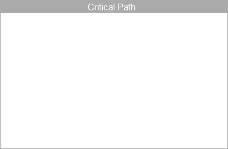

# Project Management

### Church Governance Structure

### Constraints
The cost of the website and marketing materials would need to fit within the church's budget. Where possible, the project would use low cost tools and available resources:

* Existing staff, budget, and other resources 
* Time and skill of volunteers, donated money, goods and services
* Free resources and methods

### Budget

Free social media accounts
Free sharing
Free analytics
Low-cost Web Hosts
Ads

### Soft Systems Rich Picture

Placeholder

### Critical Path

Placeholder

### PERT

Placeholder

### Standards Resources

[United Methodist Communications: Market Your Church](http://www.umcom.org/learn/market-your-church-getting-started)

[U.S. Digital Services Playbook](http://playbook.cio.gov)

[DigitalGov Resources](http://www.digitalgov.gov/resources)

[Website Launch Checklist for Web Designers](https://github.com/tutsplus/Website-Launch-Checklist-for-Web-Designers)

[Google Web Fundamentals](https://developers.google.com/web/fundamentals)

[Google Design](http://www.google.com/design)

 