# Prototype

## United Methodist Church Re-Imagined :)

iPhone 6+, iPad, iMac
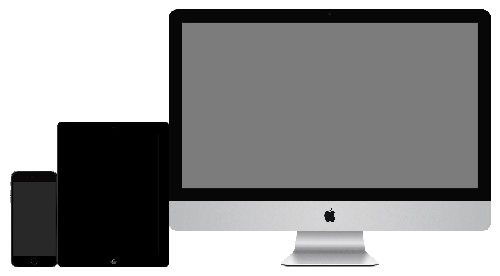

Mobile App Screen Mockups (iPhone 6+)
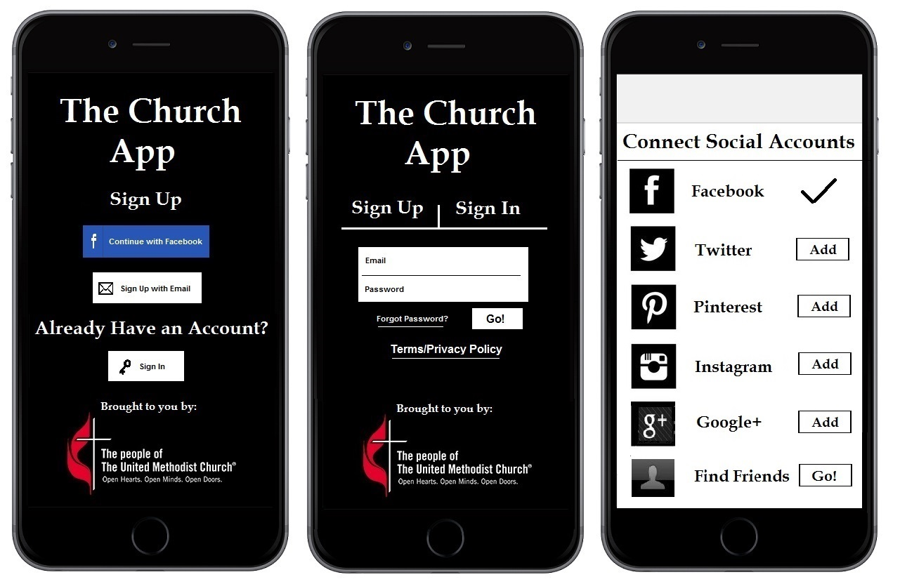

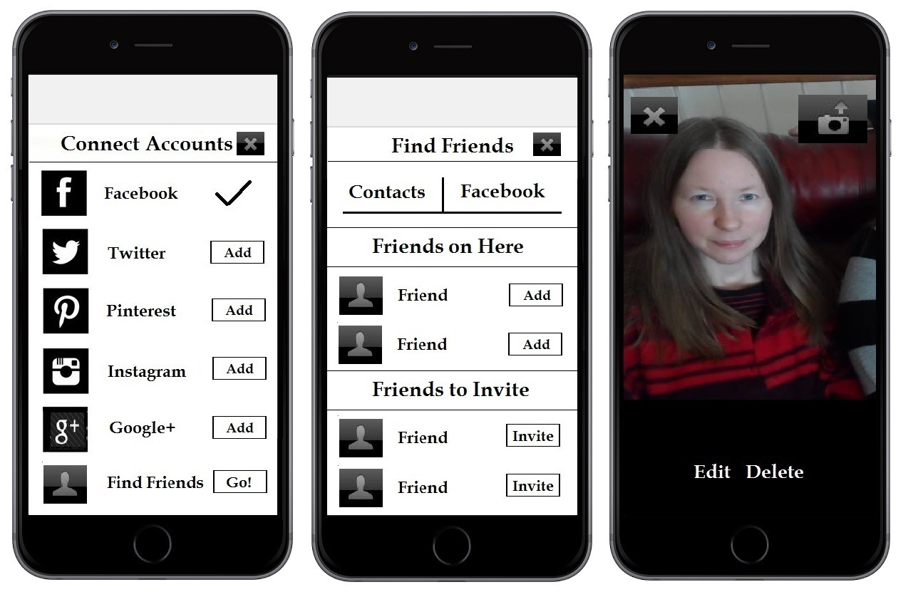

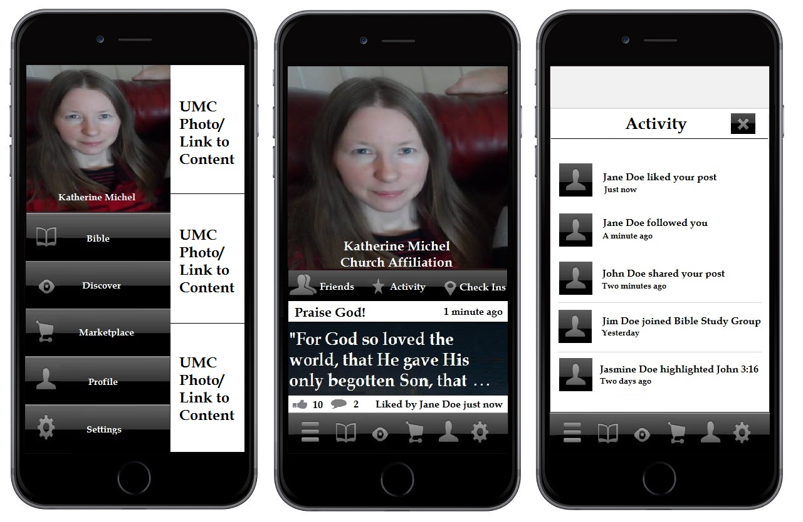

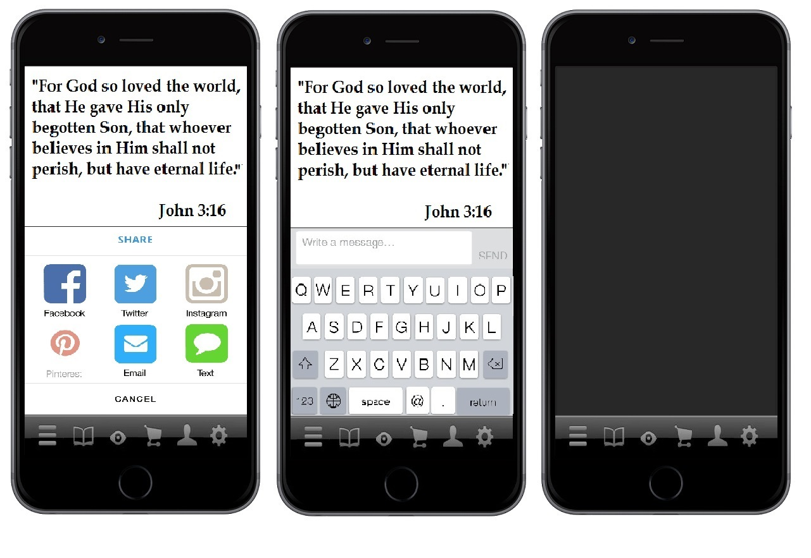

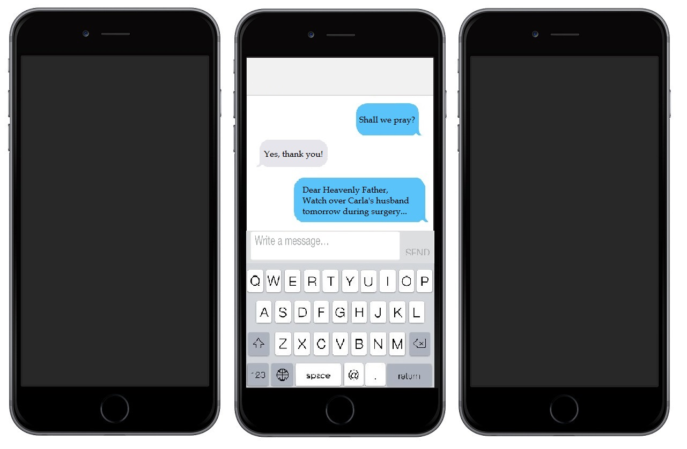

# OKRs

## Home Screen
Goal: occupy high value real estate on home screens

## Google Search (Search Engine Optimization (SEO))
Goal: be number 1 search result in search engines for relevant keyword searches

## App Stores
Goal: be number 1 search result in app stores for relevant keyword searches

### Google Play Store (Android)

#### Search 'Bible app'
Number 1 search result
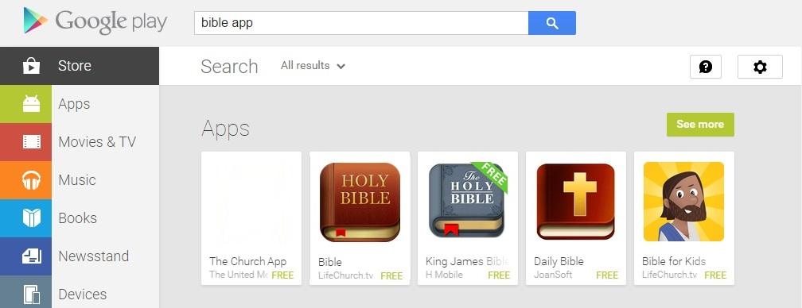

#### Search 'church app'
Number 1 search result
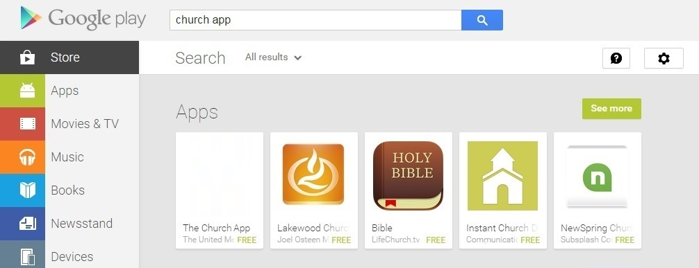

#### Search 'mobile Bible'
Number 1 search result
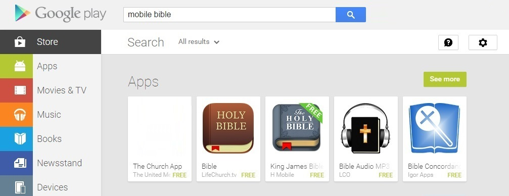

#### Search 'mobile church'
Number 1 search result
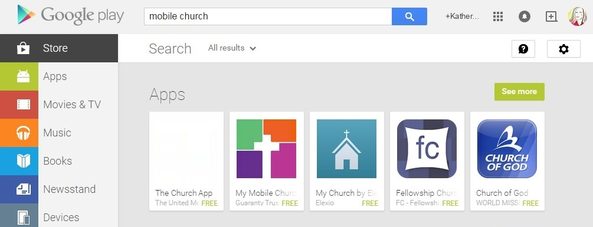

### Free App Rankings

#Apple iTunes Store
Ranking comparable to The Bible App
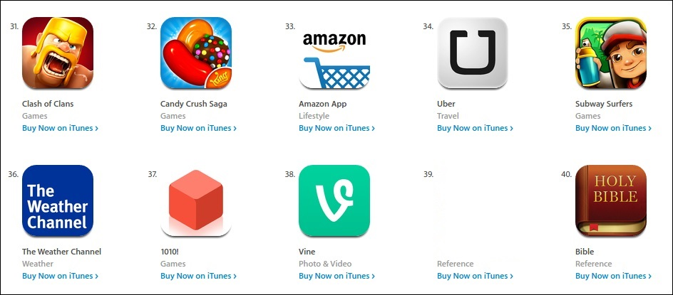

#### Google Play Store (Android)
Ranking comparable to The Bible App
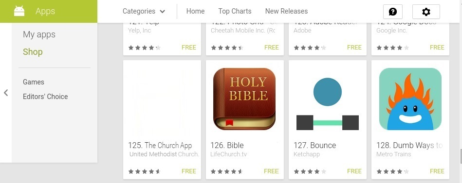

## Website, Facebook, Twitter (tweets, retweets, intents), Pinterest, Instagram profiles

## Google+ and Rich Snippet

## Google Ad

## Facebook Ad

## Twitter Ad

## Facebook OpenGraph

## Twitter Card