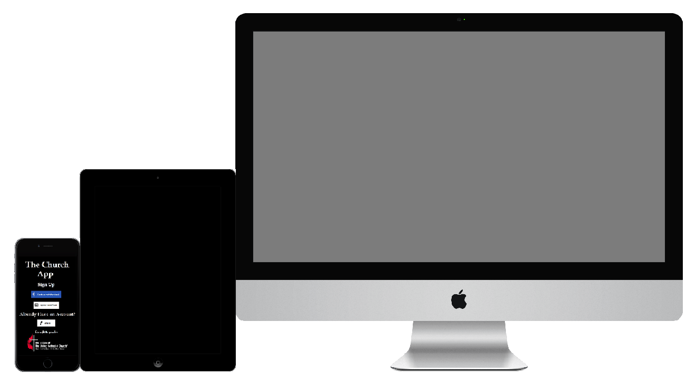
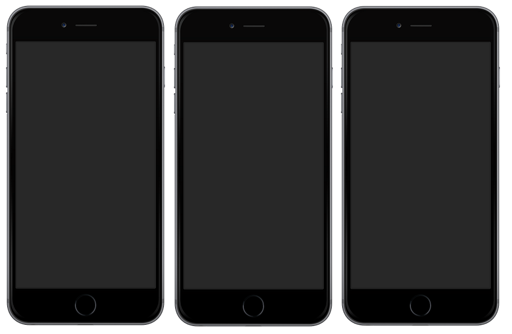

# Prototype

## National Church Re-Imagined :)

iPhone 6+, iPad, iMac

Inspiration from Snapchat for Bible study, including ephermal scripture messaging

Inspiration from Snapchat Discover for portal to United Methodist content

Snapchat Homepage

Snapchat Discover

Calling a venture [X for Y](http://avc.com/2014/01/this-for-that) is often frowned upon. I decided to do it in this case because Snapchat is synonymous with ephemeral messaging and this is a unique use case. It make for an interesting juxtaposition between the traditional and the modern.

Prioritized list of tasks users could accomplish ("user stories")

Whole experience, start to finish:
simple, intuitive

* Login and Sign Up
* eCommerce
* Calendars
* News/Activity feeds
* Weather
* Comments
* Menus
* Search
* Galleries
* Profiles
* Settings
* Lists
* Media
* Sharing

### Adult app

* Designed for desktop and mobile
* Questionnaire at beginning of app to customize content
* Product tour

#### Snapchat Inspiration
* Bible passages as daily ephemeral messages

* Online Bible that can read, highlighted, bookmarked, and shared on social networks
* Language translation
* Accessibility

Favorite passage bookmarked

Sharing
* Facebook sharing/OpenGraph
* Twitter Cards/Twitter Intents
* Share buttons (Facebook, Twitter, Pinterest, Instagram, Google+)

Payments and Fundraising
* Bitcoin- small payments
* Crowd-funding

Crowd-sourced volunteers

Kids app
* Gamification

### Market Size
* Number of United Methodist members total: 12.1 million
* Number of United Methodist congregations: 34,892

### Network Effect
* Number of United Methodist members total: 12.1 million
* Number of United Methodist congregations: 34,892

### Primary Users

#### Primary User Segmentation

##### U.S.
* Number of United Methodist members (U.S.): 7,725,039

##### Global
* Number of United Methodist members (rest of the world): 4.4 million

### User Acquisition
* World population: ~7 billion
* Number of Christians
* Number of people with internet: 
* Number of people with desktop computers:
* Number of people with mobile phones:

### Advanced Marketing
* Search Result Discovery (commonly used search terms in name of app- "Bible app" leads to Google Search result "The Bible App" which leads to The Bible App website, selection of platforms, website and app lead to LifeChurch)
* Direct Search Discovery
* Top- App Stores (Google Play/Apple iTunes), Google Search

* Desktop
* Android
* iPhone

* Website
* Facebook, Twitter, Pinterest, Instagram Profiles
* Search Engine Optimization
* Google+ and Google Rich Snippets
* Facebook Advertising
* Google AdWords
* Google Keyword Planner
* Twitter Advertising

* Google Consumer Surveys (pay)

* MailChimp (email management)

* Google Webmaster
* Yahoo and Bing Webmaster
* Google Analytics
* Facebook Insights (analytics)
* Twitter Analytics
* Google AdSense (embedded advertising)

* Facebook Audience Network (mobile advertising) (Pay)

