# Research Sprint
What's the matter with the [United Methodist Church](http://www.umc.org)? Looking at the steady decline of interest in the United Methodist Church and how it can be fixed.

## Reverse Engineering for Success
The questions I seek to answer in my research sprint:
* Whom should the church reach?
* How should the church reach them?
* What does a successful global United Methodist presence look like?

# Whom Should the Church Reach?

"In the next 10 years, I expect at least five billion people worldwide to own smartphones, giving every individual with such a phone instant access to the full power of the Internet, every moment of every day." -Marc Andreessen on [Why Software is Eating the World](http://www.wsj.com/articles/SB10001424053111903480904576512250915629460), 2011

## Declining United Methodist Membership in the U.S.

Google Trends graph for the phrase ["United Methodist Church" (region: worldwide)](http://www.google.com/trends/explore#q=United%20Methodist%20Church), from around 2004 to 2015. This declining traffic was predominantly from the United States.

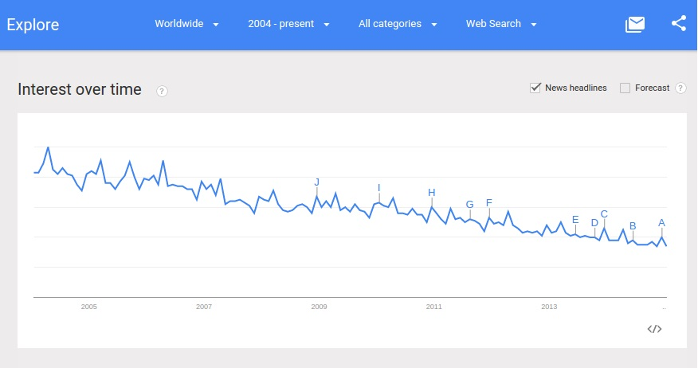

According to the [United Methodist State of the Church Report, 2012](http://s3.amazonaws.com/Website_Properties/state-of-the-church/documents/2012-state-of-the-church-report.PDF), between the years 2000 and 2010, United Methodist membership in the United States declined by 7.8% to 7,570,541 members. 

The United Methodist Church also reported in [The Book of Discipline](http://www.umc.org/who-we-are/developments-and-changes-since-1968), 2012, that United Methodist membership in the United States and Europe has been declining since 1968.

## United Membership Trends Mirror Those of Other Mainline Churches
The problem of declining U.S. membership is not exclusive to the United Methodist Church. Mainline churches in general are struggling to stay relevant in the U.S. 

The United Methodist Church [has reported](http://www.umc.org/news-and-media/mixed-blessings-in-new-us-church-numbers) that, "The United Methodist Church remains the third-largest religious group in the United States, and its membership trends - decreases in the United States and increases in other countries - mirror those of other mainline denominations."

Google Trends graph for the phrases ["United Methodist" "Catholic" "Presbyterian" "Baptist" (region: worldwide)](http://www.google.com/trends/explore#q=United%20Methodist%2C%20Catholic%2C%20Presbyterian%2C%20Baptist&cmpt=q&tz=), from around 2004 to 2015:
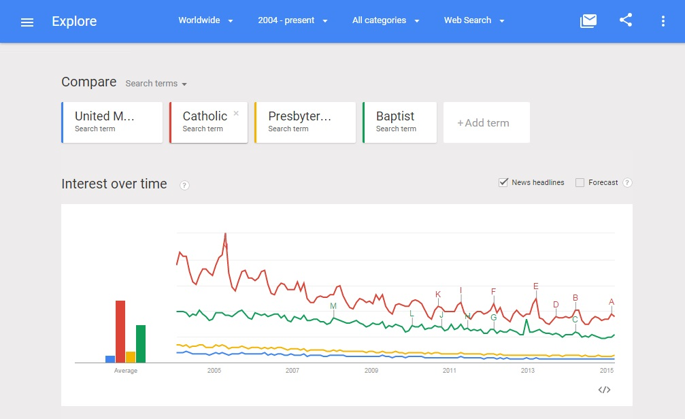

## Increasing United Methodist Membership in Developing Countries
However, according to the [United Methodist State of the Church Report, 2012](http://s3.amazonaws.com/Website_Properties/state-of-the-church/documents/2012-state-of-the-church-report.PDF), between the years 2000 and 2010, worldwide United Methodist membership went up 25% as membership in Africa and the Philippines skyrocketted by as much a 297.6%. 

| Region | % Change in Membership, Highest to Lowest, 2000-2010 |
| -- | -- |
| West Africa | 297.6% |
| Congo | 253.9% |
| Africa Central | 170.8% |
| Philippines | 156.5% |
| United States | Approximately -9% (*discrepancy*) |
| Germany | -16.2% |
| Northern Europe and Eurasia | -20% |
| Central and Southern Europe | -25.6% |
| Total Change | +25% |

| Region | Total Membership in 2010 |
| -- | -- |
| U.S. | 7,570,541 (down by -721,990 (*discrepancy*)) |
| African regions | 4,191,108 (up by 3,014,552) |
| Philippines | 145,642 (up by 88,872 (*discrepancy*)) |
| Europe and Eurasia | 63,760 (down by 15,611) 

Projected membership by 2020, using same percentage change as 2000 to 2010

| Region | Projected Membership, 2020 |
| -- | -- |
| U.S. | 6,980,038 | 
| Africa | 14,920,344 | 
| Philippines | 227,929 |

## Summary
Even though the U.S. still has the largest percentage of United Methodist members, this number is steadily decreasing. Meanwhile, Africa, a continent with a population of 1+ billion, at this rate of growth, will have twice as many United Methodist members as the U.S. by 2020. Growth in the Phillipines is big percentage-wise though considerably smaller in number than that of Africa. Membership in Europe and Euroasia is declining, but already small. 

Of course, the United Methodist Church seeks to minister to all of its members and potential members worldwide. A timely opportunity exists to use technology to appeal to potential members in places where membership is on the decline, and to help grow membership in places where it is rapidly increasing. 

# How Should the Church Reach Them?
How the church should reach them can be analyzed by studying 3 theories that originated from some of the best minds in tech:
* "Software is Eating the World"
* "Mobile is Eating the World"
* "Software is Reorganizing the World"

## Software is Eating the World
[Marc Andreessen](https://twitter.com/pmarca) famously explained his theory of [Why Software Is Eating The World](http://online.wsj.com/article/SB10001424053111903480904576512250915629460.html) in the Wall Street Journal in 2011. 

I am paraphrasing: 
A "technological and economic shift" is happening. The world is becoming a global, digitally wired economy. The masses have growing access to personal computers, broadband, and now smartphones. Online services are increasingly more popular, becoming permanently integrated with daily habits. As demand grows, more low-cost SaaS and PaaS infrastructure products (Amazon Web Services, Heroku, Digital Ocean, ect.) are being offered that enable entrepreneurs to launch online businesses by renting micro-instances of infrastructure, and pay as they go, unlike in the past, when businesses had to spend five, six figures or more for the full computer infrastructure equipment needed to keep a business up and running. Suddenly, incumbent moats, barriers of entry of ago are becoming a thing of the past. A couple of agile software developers working out of an apartment can write the software needed to create a global business that threatens a slower-moving, large-scale, established incumbent business. This happened in the case of Amazon, and many others. Even companies with previously no connection at all to software are being "eaten by software," as more services are being delivered (and expected to be delivered) online. 

Marc Andreessen: "Companies in every industry need to assume that a software revolution is coming... in many industries, new software ideas will result in the rise of new Silicon Valley-style start-ups that invade existing industries with impunity. Over the next 10 years, the battles between incumbents and software-powered insurgents will be epic."

## Mobile is Eating the World
The "Software is Eating the World" theory was revisted in 2014 by [Marc Andreessen](https://twitter.com/pmarca) and his investing partner [Ben Horowitz](https://twitter.com/bhorowitz) in the A16Z podcast: "[Ben and Marc Explain (Practically) Everything – Part 1](http://a16z.com/2014/08/25/a16z-podcast-ben-and-marc-explain-practically-everything-part-1)," this time with a focus on the "Mobile is Eating the World," theory also illustrated by this [slidedeck](http://a16z.com/2014/10/28/mobile-is-eating-the-world) by A16Z partner [Benedict Evans](https://twitter.com/BenedictEvans), and in this WSJ article, "[Never Mind Software – Mobile is Eating the World.](http://blogs.wsj.com/digits/2014/10/28/never-mind-software-mobile-is-eating-the-world)"

Marc Andreessen: "Starting in 2007, with the iPhone, the smartphone comes out. The smartphone finally packages computers in a form where everybody on the planet can have one... I think everybody on the planet by the end of the decade is going to have a smartphone. Effectively everybody. Almost everybody. Including in places where it’s still hard to get electricity or water, people are going to have smartphones... So, I think we’re going to live in a world by the end of the decade in which there’s five, six, seven billion smartphones in people’s hands, which means five, six, seven billion people in the world connected to the Internet with what we would consider modern tools and technologies and access... I think the next five years is basically prime time to think about every business, every industry, every field and say, “Well, how can we reinvent it now knowing that software can basically play such an important role in everything.”

A few slides from the [Mobile is Eating the World](http://a16z.com/2014/10/28/mobile-is-eating-the-world) slidedeck, by Benedict Evans of A16Z: 

"The unconnected are shrinking"
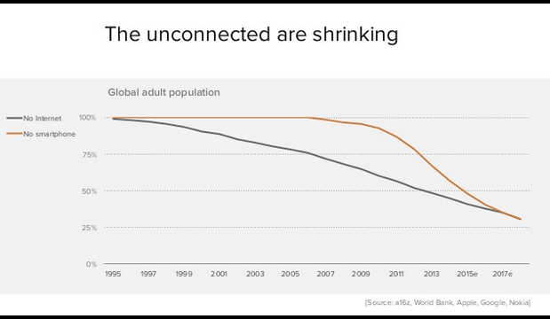

Between 2014 and 2020, "Another billion people will come online, all due to smartphones."
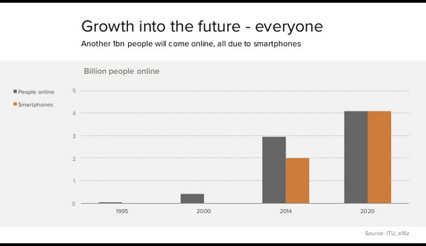

"By 2020 80% of the adults on earth will have a smartphone."
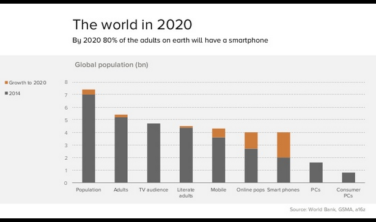

"The smartphone industry dwarfs PCs"
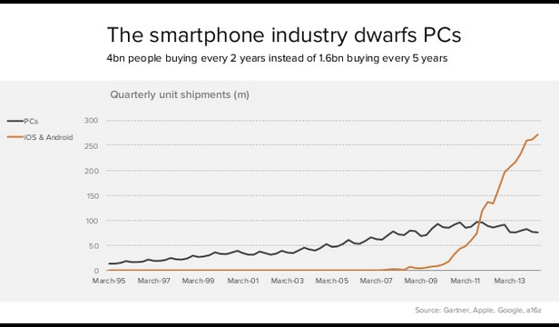

"More time is spent in mobile apps than on all of the web"
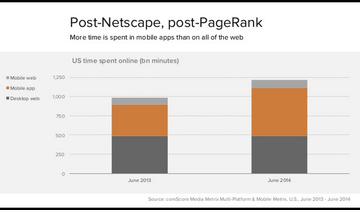

## Software is Reorganizing the World
Not only are "Software and Mobile Eating the World," but "communities" of people are reorganizing online in the "cloud," as explained by Balaji Srinivasan ([@balajis](https://twitter.com/balajis)) of A16Z in the article [Software is Reorganizing the World](http://www.wired.com/2013/11/software-is-reorganizing-the-world-and-cloud-formations-could-lead-to-physical-nations)... 

"It is not immediately obvious where those seeking opportunity might head today. Every square foot of earth is already spoken for by one (or more) nation states, every physical frontier long since closed.

With our bodies hemmed in, our minds have only the cloud — and it is the cloud that has become the destination for an extraordinary mental exodus. Hundreds of millions of people have now migrated to the cloud, spending hours per day working, playing, chatting, and laughing in real-time HD resolution with people thousands of miles away … without knowing their next-door neighbors.

Though the separation between our bodies is still best characterized by the geographical distance between points on the surface of the earth, the distance between our minds is increasingly characterized by a completely different metric: the geodesic distance, the number of degrees of separation between two nodes in a social network. 

Perhaps the single most important feature of these states of mind is the increasing divergence between our social and geographic neighbors, between the cloud formations of our heads and the physical communities surrounding our bodies. An infinity of subcultures outside the mainstream now blossoms on the Internet — vegans, body modifiers, CrossFitters, Wiccans, DIYers, Pinners, and support groups of all forms. Millions of people are finding their true peers in the cloud, a remedy for the isolation imposed by the anonymous apartment complex or the remote rural location."

## Summary
Based on the theories of [Software is Eating the World](http://online.wsj.com/article/SB10001424053111903480904576512250915629460.html), [Mobile is Eating the World](http://a16z.com/2014/10/28/mobile-is-eating-the-world), and [Software is Reorganizing the World](http://www.wired.com/2013/11/software-is-reorganizing-the-world-and-cloud-formations-could-lead-to-physical-nations), we can surmise that in the future, the world will be largely automated by software. The successful organizations will tend to be those that leverage the power of mobile, particularly smartphones, to meet the needs of people reorganizing in the "cloud."

# What Does a Successful Global United Methodist Presence Look Like?
Does the above description of a successful organization of the future fit the United Methodist Church? If not, should the United Methodist Church be more like this description?
   
A successful global United Methodist presence is one that changes with the times to best meet the needs of current members, pontential future members and others in need. 

## Gap Analysis
One way to know if the United Methodist Church should be more like this description of a successful organization of the future may be to analyze a church that is already closer to fitting this description. The name of the church is [LifeChurch](http://www.lifechurch.tv). 

In the article [Surviving Disruption](https://hbr.org/2012/12/surviving-disruption), Max Wessel and Clayton Christensen explain how a company can disrupt itself in order to avoid being disrupted:

* Identify the strengths of your disrupter’s business model
* Identify your own relative advantages
* Evaluate the conditions that would help or hinder the disrupter from co-opting your current advantages in the future.

LifeChurch does not have physical churches in 

## LifeChurch

In the theory of Software is Eating the World, LifeChurch is the young, agile tech startup bootstrapped by a few techies, threatening the slower-moving, large-scale, established incumbent organization, which happens to be the United Methodist Church. Yes, the list of organizations that previously had no connection to software at all, but are now being "eaten by software" now includes religious organizations. 

Though it might be counter-intuitive to think of religious organizations as competing against one another, the [Pew Religious Landscape Survey](http://religions.pewforum.org/reports) refers the religious marketplace as "very competitive," due to the constant flux of people. 

Google Trends graph for the phrases ["LifeChurch" and "The Bible App" (region: worldwide)](http://www.google.com/trends/explore#q=LifeChurch%2C%20The%20Bible%20App&cmpt=q&tz=), from 2004 to 2015. [LifeChurch](http://en.wikipedia.org/wiki/LifeChurch.tv) is The Bible App's parent organization. LifeChurch was founded in 1996, but began offering online broadcasts in 2006. [The Bible App](https://www.bible.com/app), one of LifeChurch's flagship products, was founded in 2008. 
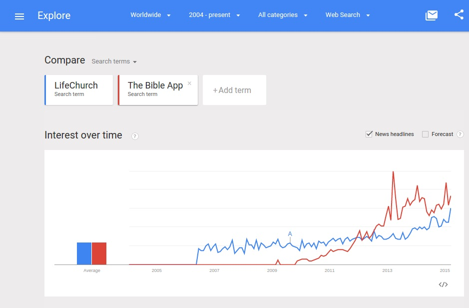

LifeChurch's Google Trends Graph results are up and to the right.

Google Trends graph for phrases ["United Methodist Church" "LifeChurch" "The Bible App" "Upworthy"](http://www.google.com/trends/explore#q=United%20Methodist%20Church%2C%20LifeChurch%2C%20The%20Bible%20App%2C%20Upworthy&cmpt=q&tz=) from 2004 to 2015

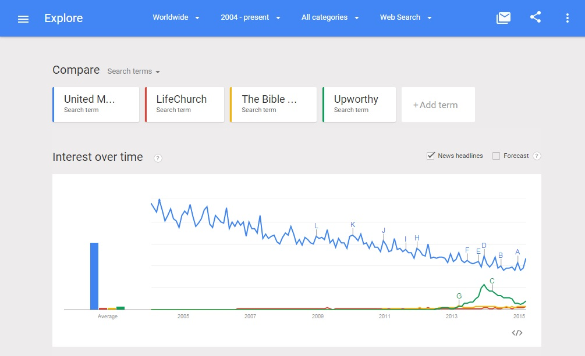

The United Methodist Church, with its declining interest, is still a "giant" compared to LifeChurch and The Bible App. However, LifeChurch and the Bible App are on the rise with the type of strong, modern network effect in place that could unexpectedly disrupt a traditional church.

## iPhone Launches and Mobile Takes Off
Marc Andreessen wrote his Software is Eating the World op-ed in 2011, just four years after the [iPhone](http://en.wikipedia.org/wiki/IPhone) launched. The subsequent popularity of the iPhone and other mobile products, such as [Android](http://en.wikipedia.org/wiki/Android_%28operating_system%29), can be clearly seen in the graph below. Words associated with mobile ("iPhone" "app" "Android") are "up and to the right." Non-mobile words ("desktop" "website") are on the decline.

Google Trends graph for phrases ["iPhone" "app" "Android" "desktop" "website" (region: worldwide)](http://www.google.com/trends/explore#q=iPhone%2C%20app%2C%20Android%2C%20desktop%2C%20website&cmpt=q&tz=), from 2004 to 2015. 
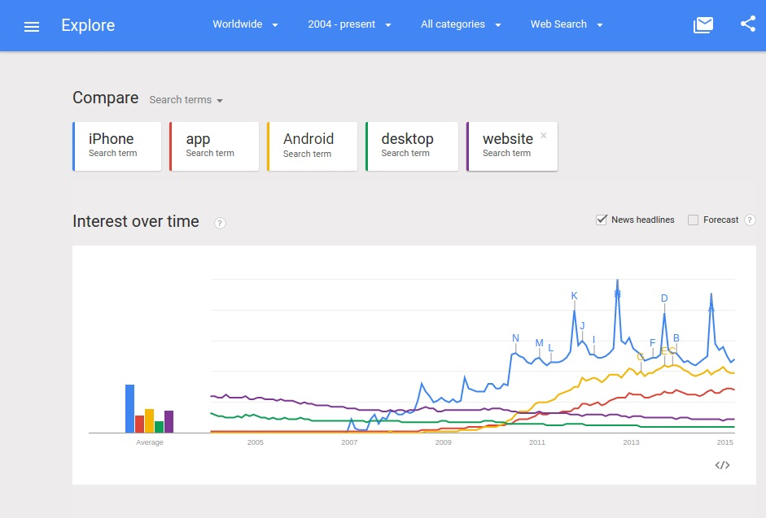

Also, when the iPhone launched, a corresponding market for church-related mobile products was immediately born, as illustrated in the Google Trends graph below. New technologies create new markets.

Google Trends graph for phrases ["church iPhone" "church app" "church Android" "church desktop" "church website" (region: worldwide)](http://www.google.com/trends/explore#q=church%20iPhone%2C%20church%20app%2C%20church%20Android%2C%20church%20livestream&cmpt=q&tz=), from 2004 to 2015.
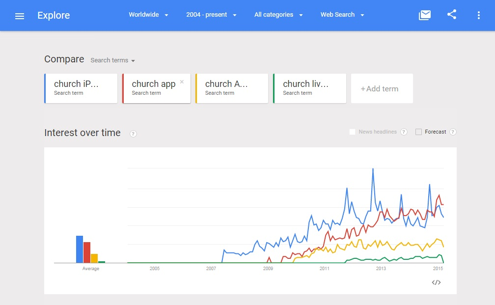

## What Does Increasing Mobile Phone (and Smartphone) Ownership in Developing Countries Mean for The Global United Methodist Church?

Basically, people in developed countries such as the United States (where United Methodist membership is on the decline) tend to be able to afford laptops and/or smartphones. In developing countries, such as Africa and the Phillipines (where United Methodist membership is skyrocketting), the people tend to not be able to afford a laptop. But they may be able to afford mobile phones, and increasingly smartphones, as prices fall. Such phones will be used as a lifeline- for education, banking (many do not have a bank account or traditional credit), to own a small business (which will help bring people out of poverty and build up the economy), to connect with people from around the world (just like many people in developed countries already do), and perhaps to read the Bible! Unlike those of us accustomed to owning laptops, for many people in developing countries, the phone may be the first and only computer that the person will have ever owned.  

### Smartphone Penetration in Developing Countries

We can see from this chart based on World Bank data that mobile phone subscriptions in the developing world have vastly overtaken those of the developed world. Chart credit: [CFS Asset Management](http://www.cfsgam.com.au)

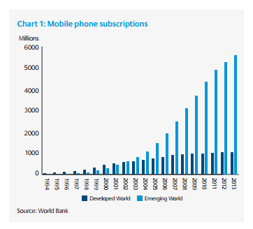

http://www.pewglobal.org/2015/04/15/cell-phones-in-africa-communication-lifeline

Not only will another one billion people com online by 2020, and spend more time using mobile apps than web if the trend continues... 

Sub-Saharan Africa population coverage, "The utility of mobile increases as income falls." 
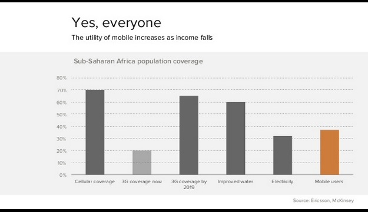

Benedict Evans revisted the above Sub-Saharan Africa slide in a [Twitter thread](https://twitter.com/BenedictEvans/status/583489997203869698) on April 2, 2015. 

## To What Extend Can a Different Tech Approach Help the United Methodist Church?
According to the United Methodist [The Book of Discipline](http://www.umc.org/who-we-are/developments-and-changes-since-1968)), published in 2012, United Methodist membership in the United States and Europe has been declining since 1968, before web and mobile technlogies became available to the masses. This indicates that the decline in membership is at least due in part to non-tech related apathy toward the religion, rather than tech-related lifestyle change. Presumably, a change in tech approach will do little to help in the case of non-tech related apathy, because tech is not at the root of the problem. However, tech could still play a part in maintaining or increasing membership. 

## Paradox of Increased Giving
Though in recent years U.S. membership and local church spending have gone down, the United Methodist church [has reported that](http://www.umc.org/news-and-media/mixed-blessings-in-new-us-church-numbers) at times, dramatically more amounts of money have been given giving to charitable causes through the United Methodist Church. For instance, in 2010, "direct giving to United Methodist-related causes increased by more than 29 percent" and the United Methodist Committee on Relief received 146% more, in part due to the disaster in Haiti. 

