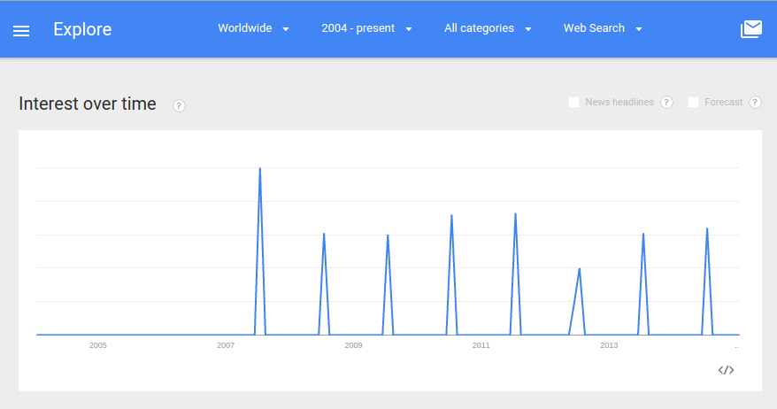

# Research Sprint

## Helpful Resource

[Questions to Ask Before Starting User Research](http://www.gv.com/lib/questions-to-ask-before-starting-user-research) by Google Ventures.

## Identify

* Question(s) to answer
* Business problem
* Business opportunity
* Features/tasks to test

## Question to Answer

* Whom should the church reach and how?
* How does the church remain vital?

### The "Business" Problem

* Dwindling, predominantly older adult local population 
* Changing lifestyles (digital and philosophical reorganization)
* Four churches in close proximity

### The "Business" Opportunity

* Decreasing importance of physical proximity
* Larger potential user base
* More channels than ever to reach people
* Untapped digital resources

### Google Trends for "Pretty Prairie"

Unfortunately, Google Trends does not go into enough detail to give results for "Pretty Prairie United Methodist Church," but here is a fun graph for the results for ["Pretty Prairie" (region: worldwide)](http://www.google.com/trends/explore#q=pretty%20prairie), from around 2004 to September 2004; The town of Pretty Prairie, Kansas happens to host the world famous [Pretty Prairie Rodeo](http://www.pprodeo.com) (the biggest night rodeo in Kansas) every July. The spikes in the Google Trends graph below all happened in July :) 

The Google Trends graph for "[Pretty Prairie Rodeo" (region: worldwide)](http://www.google.com/trends/explore#q=%22pretty+prairie+rodeo%22) demonstrates similar spikes in interest. 

## Changing Landscape

According to Marc Andreessen, [Software is Eating the World](http://online.wsj.com/article/SB10001424053111903480904576512250915629460.html)

[Software is Reorganizing the World](http://www.wired.com/2013/11/software-is-reorganizing-the-world-and-cloud-formations-could-lead-to-physical-nations)

Though there is an "upper bound" to area population, as Balaji Srinivasan points out, "when cloud formations take physical shape, neither their scale nor duration has an upper bound." 

Furthermore, according to Fred Wilson, [Mobile is Eating the World](http://www.avc.com/a_vc/2013/06/mobile-is-eating-the-world.html)

Mobile leap-frogging desktop

## Geographic and Demographic Info

##### Nielson Company Demographic Info

Through the national United Methodist Church Communications Office, I obtained the most recent Nielson Company demographic info for the city of Pretty Prairie, Kansas. 

Pretty Prairie [Area Map](https://drive.google.com/file/d/0B02bpu7HZwJRaVp5dGNMOUpYbU0/view?usp=sharing)

[Executive Summary](https://drive.google.com/file/d/0B02bpu7HZwJRMFJTM3BWZXprbWM/view?usp=sharing)

[Household Trends](https://drive.google.com/file/d/0B02bpu7HZwJRV1dnSGplRUxmMDg/view?usp=sharing)

[Pop-Facts: Census Demographic Overview 2014 Report](https://drive.google.com/file/d/0B02bpu7HZwJRSHFwVm5kX0FHMmc/view?usp=sharing)

[Population by Age and Race Trend 2014](https://drive.google.com/file/d/0B02bpu7HZwJRelJTXzd1XzVWUE0/view?usp=sharing)

Pretty Prairie, in Central Kansas, West of Wichita, North of Kingman, South of Hutchinson, near the Amish community of Yoder

