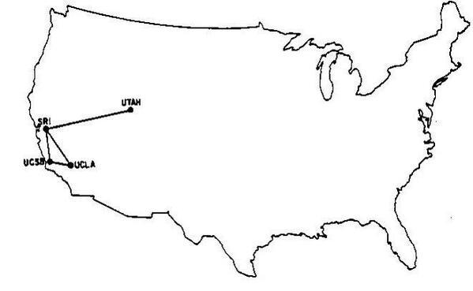
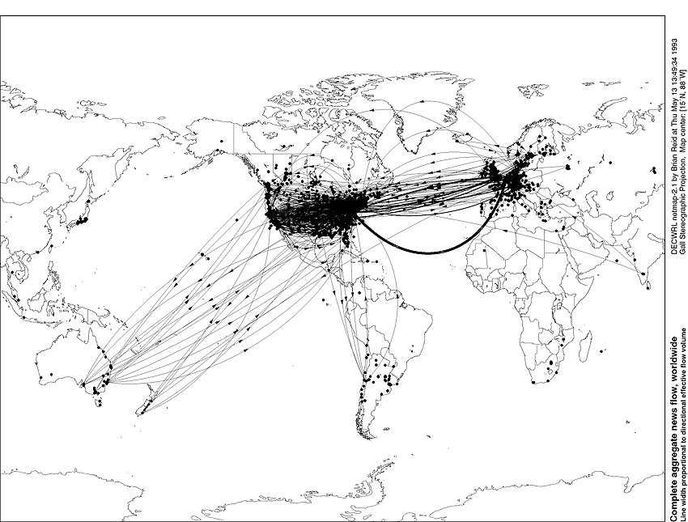

# Research Sprint
What's the matter with the [United Methodist Church](http://www.umc.org)? Looking at the steady decline of interest in the United Methodist Church and how it can be fixed.

## Reverse Engineering for Success
The questions I seek to answer in my research sprint:
* Whom should the church reach?
* How should the church reach them?
* What does a successful global United Methodist presence look like?

# Whom Should the Church Reach?

"In the next 10 years, I expect at least five billion people worldwide to own smartphones, giving every individual with such a phone instant access to the full power of the Internet, every moment of every day." -Marc Andreessen on [Why Software is Eating the World](http://www.wsj.com/articles/SB10001424053111903480904576512250915629460), 2011

## Google Trends Graph for "United Methodist Church"

Google Trends graph for the phrase ["United Methodist Church" (region: worldwide)](http://www.google.com/trends/explore#q=United%20Methodist%20Church), from around 2004 to 2015. 

This declining search interest traffic was almost 100% from the United States. 

## Declining United Methodist Membership in the U.S.

According to the [2012 United Methodist State of the Church Report](http://s3.amazonaws.com/Website_Properties/state-of-the-church/documents/2012-state-of-the-church-report.PDF) (the latest report of its kind), between 2000 and 2010, United Methodist membership in the United States declined by 7.8%.  

Note, this chart has a couple of discrepancies; It appear that "Change in Membership" should have:
* Philippines: 88,872
* U.S.: -721,990

According to my math, with "Change in Membership" for U.S. as -721,990, "% Change in Membership" would be approximately -9%. 

## Declining Interest in Mainline Churches

This problem of declining interest is not exclusive to the United Methodist Church. Mainline churches in general are struggling to stay relevant. 

The United Methodist Church [has reported](http://www.umc.org/news-and-media/mixed-blessings-in-new-us-church-numbers), "The United Methodist Church remains the third-largest religious group in the United States, and its membership trends - decreases in the United States and increases in other countries - mirror those of other mainline denominations."

Google Trends graph for the phrases ["United Methodist" "Catholic" "Presbyterian" "Baptist" (region: worldwide)](http://www.google.com/trends/explore#q=United%20Methodist%2C%20Catholic%2C%20Presbyterian%2C%20Baptist&cmpt=q&tz=), from around 2004 to 2015:

## Increasing United Methodist Membership in Developing Countries

According to the [2012 United Methodist State of the Church Report](http://s3.amazonaws.com/Website_Properties/state-of-the-church/documents/2012-state-of-the-church-report.PDF), though membership is on the decline in the United States, between 2000 and 2010, membership has gone up 25% worldwide, due to skyrocketing membership in parts of Africa and the Philippines.

| Region | % Change in Membership, Highest to Lowest, 2000-2010 |
| -- | -- |
| West Africa | 297.6% |
| Congo | 253.9% |
| Africa Central | 170.8% |
| Philippines | 156.5% |
| United States | Approximately -9% (*discrepancy*) |
| Germany | -16.2% |
| Northern Europe and Eurasia | -20% |
| Central and Southern Europe | -25.6% |
| Total Change | +25% |

| Region | Total Membership in 2010 |
| -- | -- |
| U.S. | 7,570,541 (down by -721,990 (*discrepancy*)) |
| African regions | 4,191,108 (up by 3,014,552) |
| Philippines | 145,642 (up by 88,872 (*discrepancy*)) |
| Europe and Eurasia | 63,760 (down by 15,611) 
So, even though the U.S. has the largest percentage of United Methodist members, this number is steadily stagnating. Meanwhile, membership in Africa threatens to overtake that of the United States. Growth in the Phillipines is big percentage-wise though considerably smaller than that of Africa in comparison. Membership in Europe and Euroasia is declining, but already small. 

Projected membership by 2020, using same percentage change as 2000 to 2010

| Region | Projected Membership, 2020 |
| -- | -- |
| U.S. | 6,980,038 | 
| Africa | 14,920,344 | 
| Philippines | 227,929 |

At this rate, Africa will have more than doubled the U.S. in United Methodist membership by 2020. And Africa has room for growth with its population of 1+ billion. Though of course the United Methodist Church would seek to minister to people anywhere in the world, clearly the religion is trending more in some places than others. 

# How should the church reach them?

## Software is Eating the World
[Marc Andreessen](https://twitter.com/pmarca) famously explained his theory of [Why Software Is Eating The World](http://online.wsj.com/article/SB10001424053111903480904576512250915629460.html) in the Wall Street Journal in 2011. 

It goes like this: 
A "technological and economic shift" is happening. The world is becoming a global, digitally wired economy. The masses have growing access to personal computers, broadband, and now smartphones. Online services are increasingly more popular, becoming permanently integrated with daily habits. As demand grows, more low-cost SaaS and PaaS infrastructure products (Amazon Web Services, Heroku, Digital Ocean, ect.) are being offered that enable entrepreneurs to launch online businesses by renting micro-instances of infrastructure, and pay as they go, unlike in the past, when businesses had to spend five, six figures or more for the full computer infrastructure equipment needed to keep a business up and running. Suddenly, incumbent moats, barriers of entry of ago are becoming a thing of the past. A couple of agile software developers working out of an apartment can write the software needed to create a global business that threatens a slower-moving, large-scale, established incumbent business. This happened in the case of Amazon, and many others. Even companies with previously no connection at all to software are being "eaten by software," as more services are being delivered (and expected to be delivered) online. 

"Companies in every industry need to assume that a software revolution is coming... in many industries, new software ideas will result in the rise of new Silicon Valley-style start-ups that invade existing industries with impunity. Over the next 10 years, the battles between incumbents and software-powered insurgents will be epic." 
-Marc Andreessen

## iPhone Launches and Mobile Takes Off
Marc Andreessen wrote his Software is Eating the World op-ed just four years after the [iPhone](http://en.wikipedia.org/wiki/IPhone) launched. The subsequent popularity of the iPhone and other mobile products, such as [Android](http://en.wikipedia.org/wiki/Android_%28operating_system%29), can be clearly seen in the graph below. Words associated with mobile ("iPhone" "app" "Android") are "up and to the right." Non-mobile words ("desktop" "website") are on the decline.

Google Trends graph for phrases ["iPhone" "app" "Android" "desktop" "website" (region: worldwide)](http://www.google.com/trends/explore#q=iPhone%2C%20app%2C%20Android%2C%20desktop%2C%20website&cmpt=q&tz=), from 2004 to 2015. 

Also, when the iPhone launched, a corresponding market for church-related mobile products was immediately born, as illustrated in the Google Trends graph below.

Google Trends graph for phrases ["church iPhone" "church app" "church Android" "church desktop" "church website" (region: worldwide)](http://www.google.com/trends/explore#q=church%20iPhone%2C%20church%20app%2C%20church%20Android%2C%20church%20livestream&cmpt=q&tz=), from 2004 to 2015.

## Mobile is Eating the World
The "Software is Eating the World" theory was revisted in 2014 by [Marc Andreessen](https://twitter.com/pmarca) and his investing partner [Ben Horowitz](https://twitter.com/bhorowitz) in the A16Z podcast: "[Ben and Marc Explain (Practically) Everything – Part 1](http://a16z.com/2014/08/25/a16z-podcast-ben-and-marc-explain-practically-everything-part-1)," this time with a focus on the "Mobile is Eating the World," theory also illustrated by this [slidedeck](http://a16z.com/2014/10/28/mobile-is-eating-the-world) by A16Z partner Benedict Evans, and in the this WSJ article, "[Never Mind Software – Mobile is Eating the World.](http://blogs.wsj.com/digits/2014/10/28/never-mind-software-mobile-is-eating-the-world)"

Marc Andreessen: "Starting in 2007, with the iPhone, the smartphone comes out. The smartphone finally packages computers in a form where everybody on the planet can have one... I think everybody on the planet by the end of the decade is going to have a smartphone. Effectively everybody. Almost everybody. Including in places where it’s still hard to get electricity or water, people are going to have smartphones... So, I think we’re going to live in a world by the end of the decade in which there’s five, six, seven billion smartphones in people’s hands, which means five, six, seven billion people in the world connected to the Internet with what we would consider modern tools and technologies and access... I think the next five years is basically prime time to think about every business, every industry, every field and say, “Well, how can we reinvent it now knowing that software can basically play such an important role in everything.”

## What Does Increasing Mobile Phone (and Smartphone) Ownership in Developing Countries Mean for The Global United Methodist Church?

Basically, people in developing countries such as the United States (where United Methodist membership is on the decline) tend to be able to afford laptops and/or smartphones. In developing countries, such as Africa and the Phillipines (where United Methodist membership is skyrocketting), the people tend to not be able to afford a laptop. But they may be able to afford mobile phones, and increasingly smartphones, as the price falls. Such phones will be used as a lifeline- for education, banking (many do not have a bank account or traditional credit), to own a small business (which will help bring people out of poverty and build up the economy), to connect with people from around the world (just like many people in developed countries already do), and perhaps to read the Bible! Unlike those of us accustomed to owning laptops, for many people in developing countries, the phone may be the first and only computer that the person will have ever owned.  

We can see from this chart based on World Bank data that mobile phone subscriptions in the developing world have vastly overtaken those of the developed world. Chart credit: [CFS Asset Management](http://www.cfsgam.com.au)

A few more slides from [Mobile is Eating the World slidedeck](http://a16z.com/2014/10/28/mobile-is-eating-the-world), by Benedict Evans of A16Z: 

Sub-Saharan Africa population coverage, "The utility of mobile increases as income falls." 

Benedict Evans revisted the above Sub-Saharan Africa slide in a [Twitter thread](https://twitter.com/BenedictEvans/status/583489997203869698) on April 2, 2015. 

"The unconnected are shrinking"

Between 2014 and 2020, "Another billion people will come online, all due to smartphones."

"By 2020 80% of the adults on earth will have a smartphone."

"The smartphone industry dwarfs PCs"

"More time is spent in mobile apps than on all of the web"

## Software is Reorganizing the World

Not only will another one billion people com online by 2020, and spend more time using mobile apps than web if the trend continues, but "communities" of people are reorganizing online in the "cloud," as explained by Balaji Srinivasan ([@balajis](https://twitter.com/balajis)) of A16Z in the article [Software is Reorganizing the World](http://www.wired.com/2013/11/software-is-reorganizing-the-world-and-cloud-formations-could-lead-to-physical-nations)... 

"It is not immediately obvious where those seeking opportunity might head today. Every square foot of earth is already spoken for by one (or more) nation states, every physical frontier long since closed.

With our bodies hemmed in, our minds have only the cloud — and it is the cloud that has become the destination for an extraordinary mental exodus. Hundreds of millions of people have now migrated to the cloud, spending hours per day working, playing, chatting, and laughing in real-time HD resolution with people thousands of miles away … without knowing their next-door neighbors.

Though the separation between our bodies is still best characterized by the geographical distance between points on the surface of the earth, the distance between our minds is increasingly characterized by a completely different metric: the geodesic distance, the number of degrees of separation between two nodes in a social network. 

Perhaps the single most important feature of these states of mind is the increasing divergence between our social and geographic neighbors, between the cloud formations of our heads and the physical communities surrounding our bodies. An infinity of subcultures outside the mainstream now blossoms on the Internet — vegans, body modifiers, CrossFitters, Wiccans, DIYers, Pinners, and support groups of all forms. Millions of people are finding their true peers in the cloud, a remedy for the isolation imposed by the anonymous apartment complex or the remote rural location."

# What Does a Successful Global United Methodist Presence Look Like?

Based on the theories of [Software is Eating the World](http://online.wsj.com/article/SB10001424053111903480904576512250915629460.html), [Mobile is Eating the World](http://a16z.com/2014/10/28/mobile-is-eating-the-world), and [Software is Reorganizing the World](http://www.wired.com/2013/11/software-is-reorganizing-the-world-and-cloud-formations-could-lead-to-physical-nations), we can surmise that in the future, the world will be largely automated by software. The successful organizations will tend to be those that meet the needs of the communities of people reorganizing in the cloud. These organizations will tend to leverage the power of mobile, and will create such competitive advantages as virality and network effect. 

### Disruption
Does this description fit the United Methodist Church and if not, how can the United Methodist Church disrupt itself, before being disrupted? 

## LifeChurch
The answer to what a successful global church that leverages the power of mobile to create a network effect looks like might be found by analyzing the success of LifeChurch. 

LifeChurch is the smaller, more agile organization bootstrapped by a few techies (it actually was) that threatens the slower-moving, large-scale, established incumbent organizations (including the United Methodist Church). Yes, as organizations with previously no connection at all to software are being "eaten by software," that now includes religious organizations. 

LifeChurch's Google Trends Graph results are up and to the right.

Google Trends graph for the phrases ["LifeChurch" and "The Bible App" (region: worldwide)](http://www.google.com/trends/explore#q=LifeChurch%2C%20The%20Bible%20App&cmpt=q&tz=), from 2004 to 2015. [LifeChurch](http://en.wikipedia.org/wiki/LifeChurch.tv) is The Bible App's parent organization. LifeChurch was founded in 1996, but began offering online broadcasts in 2006. [The Bible App](https://www.bible.com/app) was founded in 2008. 

Google Trends graph for phrases ["United Methodist Church" "LifeChurch" "The Bible App" "Upworthy"](http://www.google.com/trends/explore#q=United%20Methodist%20Church%2C%20LifeChurch%2C%20The%20Bible%20App%2C%20Upworthy&cmpt=q&tz=) from 2004 to 2015

The United Methodist Church, which is clearly of declining interest, is still a "giant" compared to Upworthy at Upworthy's peak search volume. LifeChurch and The Bible App are miniscule in comparison, but on the rise and with a strong, modern network effect in place of the sort that could disrupt traditional church.

Before you argue that religions organizations are not exactly competing against each other, Pew Religion actually classifies the religions marketplace as a highly-competitive marketplace. 

Indeed, one of the concerns that I've heard about digital products, for example livestreaming a church service (one of the primary tactics of LifeChurch), is that:
1. Church-goers need not show up to church 
2. Offering may decline as a result

But these arguments may pose little relevance, because of the competitive marketplace. Church-goers can use the digital products of other denominations as replacements. 

This recent article in the United Methodist Interpreter Magazine confronts the consternation over tech versus worship services, suggesting that instead of discouraging use of tech, church-goers should be encouraged to share their worship experience online, for instance by tweeting scripture messages on Facebook or Twitter. The author of the article, actually references the LifeChurch Bible app as a method to incorporate tech and worship.  

## To What Extend Can a Different Tech Approach Help the United Methodist Church?
Is this decline in global United Methodist membership a result of changes in lifestyle, or apathy toward the religion itself? To what extent can a drastic change in technology approach turn the situation around? In the case of apathy, presumably a change in technology will approach will do little to help, because technology is not at the root of the problem.

According to [this excerpt from The Book of Discipline (2012)](http://www.umc.org/who-we-are/developments-and-changes-since-1968) published by the United Methodist Church, United Methodist membership in the United States and Europe has declined since 1968. During that same time, membership in Africa and Asia grew significantly. 

This decline in membership in the United States and Europe was not due to a change in population, since the populations of these regions have greatly increased since then. Also, this decline had already begun before the internet had become widely available. 

The Internet, 1969 

The Internet, 1993 

The United Methodist church can work to maintain current membership levels in regions where membership is declining, and minister in the most useful way to those in regions where membership is growing. In addition to the coincidence that membership is rapidly growing in developing countries where people will leap-frog desktop in favor of cheaper mobile, also, people in these regions may be recipients of some of the charitable contributions made to the United Methodist Church.

Paradoxically, even as membership and local church spending has gone down in recent years, at times, dramatically more amounts of money have been given giving to charitable causes through the United Methodist Church. For instance, in 2010, the United Methodist Committee on Relief received 146% more, in part due to the disaster in Haiti. The United Methodist Church [also reported that](http://www.umc.org/news-and-media/mixed-blessings-in-new-us-church-numbers), "Direct giving to United Methodist-related causes increased by more than 29 percent."

Laura Arillaga-Andreessen, author of the book Giving 2.0

and more recently, in the article

According to Andreessen...

Positive, also due to fundraising

## Jesus and John Wesley, Social Pioneers

As software and mobile reorganize the world, perhaps members of the the United Methodist Church need look no further than [social network](http://en.wikipedia.org/wiki/Social_network) pioneers Jesus and John Wesley for inspiration in how adapt. 

Jesus grew a social network that consisted of family, friends, and followers, who spread his message by word of mouth until it became viral the world over. 

[John Wesley](http://en.wikipedia.org/wiki/John_Wesley) spread the Methodist religion across the United States by creating a social network of followers who were organized into "Class Meetings" across geographic territories and ministered to by "Circuit Riders." 

"I look upon all the world as my parish" -John Wesley, founder of Methodism

