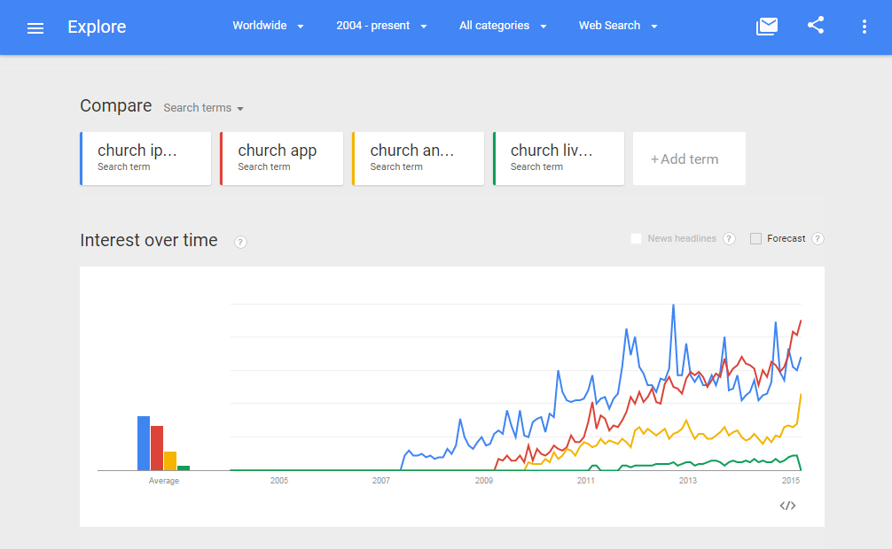

# Research Sprint

Helpful resource from Google Ventures: [Questions to Ask Before Starting User Research](http://www.gv.com/lib/questions-to-ask-before-starting-user-research)

## Global Digital and Philosophical Reorganization

### Software is Eating the World

[Marc Andreessen](https://twitter.com/pmarca) famously explained his theory of [Why Software Is Eating The World](http://online.wsj.com/article/SB10001424053111903480904576512250915629460.html) in the Wall Street Journal in 2011. 

"My own theory is that we are in the middle of a dramatic and broad technological and economic shift in which software companies are poised to take over large swathes of the economy... More and more major businesses and industries are being run on software and delivered as online services—from movies to agriculture to national defense. Many of the winners are Silicon Valley-style entrepreneurial technology companies that are invading and overturning established industry structures. Over the next 10 years, I expect many more industries to be disrupted by software, with new world-beating Silicon Valley companies doing the disruption in more cases than not... All of the technology required to transform industries through software finally works and can be widely delivered at global scale... Over two billion people now use the broadband Internet... In the next 10 years, I expect at least five billion people worldwide to own smartphones, giving every individual with such a phone instant access to the full power of the Internet, every moment of every day... On the back end, software programming tools and Internet-based services make it easy to launch new global software-powered start-ups in many industries—without the need to invest in new infrastructure and train new employees... With lower start-up costs and a vastly expanded market for online services, the result is a global economy that for the first time will be fully digitally wired... Companies in every industry need to assume that a software revolution is coming... in many industries, new software ideas will result in the rise of new Silicon Valley-style start-ups that invade existing industries with impunity. Over the next 10 years, the battles between incumbents and software-powered insurgents will be epic." 
### Mobile is Eating the World

The "Software is Eating the World" theory was revisted in 2014 by [Marc Andreessen](https://twitter.com/pmarca) and his investing partner [Ben Horowitz](https://twitter.com/bhorowitz) in the a16z podcast: "[Ben and Marc Explain (Practically) Everything – Part 1](http://a16z.com/2014/08/25/a16z-podcast-ben-and-marc-explain-practically-everything-part-1)," this time with a focus on the "Mobile is Eating the World," theory also illustrated by this [slidedeck](http://a16z.com/2014/10/28/mobile-is-eating-the-world) by a16z partner Benedict Evans.

Marc Andreessen: "Starting in 2007, with the iPhone, the smartphone comes out. The smartphone finally packages computers in a form where everybody on the planet can have one... I think everybody on the planet by the end of the decade is going to have a smartphone. Effectively everybody. Almost everybody. Including in places where it’s still hard to get electricity or water, people are going to have smartphones... So, I think we’re going to live in a world by the end of the decade in which there’s five, six, seven billion smartphones in people’s hands, which means five, six, seven billion people in the world connected to the Internet with what we would consider modern tools and technologies and access... I think the next five years is basically prime time to think about every business, every industry, every field and say, “Well, how can we reinvent it now knowing that software can basically play such an important role in everything.”

### Software is Reorganizing the World

Balaji Srinivasan ([@balajis](https://twitter.com/balajis)) famously [wrote](http://www.wired.com/2013/11/software-is-reorganizing-the-world-and-cloud-formations-could-lead-to-physical-nations)... 

"It is not immediately obvious where those seeking opportunity might head today. Every square foot of earth is already spoken for by one (or more) nation states, every physical frontier long since closed.

With our bodies hemmed in, our minds have only the cloud — and it is the cloud that has become the destination for an extraordinary mental exodus. Hundreds of millions of people have now migrated to the cloud, spending hours per day working, playing, chatting, and laughing in real-time HD resolution with people thousands of miles away … without knowing their next-door neighbors.

Though the separation between our bodies is still best characterized by the geographical distance between points on the surface of the earth, the distance between our minds is increasingly characterized by a completely different metric: the geodesic distance, the number of degrees of separation between two nodes in a social network. 

Perhaps the single most important feature of these states of mind is the increasing divergence between our social and geographic neighbors, between the cloud formations of our heads and the physical communities surrounding our bodies. An infinity of subcultures outside the mainstream now blossoms on the Internet — vegans, body modifiers, CrossFitters, Wiccans, DIYers, Pinners, and support groups of all forms. Millions of people are finding their true peers in the cloud, a remedy for the isolation imposed by the anonymous apartment complex or the remote rural location."

### United Methodist Church Scorecard
Software is eating the world: addressing this

Mobile is eating the world: little activity

Software is reorganizing the world: the theory of physical location no longer being important does not bode well for the United Methdist Church. 

#### Google Trends Graph for Phrases "iPhone" "app" "Android" "desktop" "website"

Google Trends graph for phrases ["iPhone" "app" "Android" "desktop" "website" (region: worldwide)](http://www.google.com/trends/explore#q=iPhone%2C%20app%2C%20Android%2C%20desktop%2C%20website&cmpt=q&tz=), from 2004 to 2015. Words associated with mobile ("iPhone" "app" "Android") are up and to the right. Non-mobile words ("desktop" "website") are on the decline.

Google Trends graph for phrases ["church iPhone" "church app" "church Android" "church desktop" "church website" (region: worldwide)](http://www.google.com/trends/explore#q=church%20iPhone%2C%20church%20app%2C%20church%20Android%2C%20church%20livestream&cmpt=q&tz=), from 2004 to 2015.

#### [Google Trends Graph for Phrases "United Methodist Church" "LifeChurch" "The Bible App" "Upworthy"](http://www.google.com/trends/explore#q=United%20Methodist%20Church%2C%20LifeChurch%2C%20The%20Bible%20App%2C%20Upworthy&cmpt=q&tz=) from 2004 to 2015

The United Methodist Church, which is clearly of declining interest, is still a "giant" compared to Upworthy at Upworthy's peak search volume. LifeChurch and The Bible App are miniscule in comparison, but on the rise and with a strong, modern network effect in place of the sort that could disrupt traditional church.

## Surviving Disruption

In the article [Surviving Disruption](https://hbr.org/2012/12/surviving-disruption), Max Wessel and Clayton Christensen explain how a company can disrupt itself in order to avoid being disrupted:

* Identify the strengths of your disrupter’s business model
* Identify your own relative advantages
* Evaluate the conditions that would help or hinder the disrupter from co-opting your current advantages in the future.

## United Methodist Church Re-Imagined

### Reverse Engineering for Success
* What does a successful national United Methodist Church look like?
* Whom should the church reach?
* How should the church reach them?

The idea of software reorganization does not bode well for physical churches

* Put equal emphasis on physical, digital, and partnership
* Maintain a full-stack architecture anytime possible
* Publicize to existing membership to help achieve a network effect
* Optimize for psychology and sharing
* Practice minimalism as much as possible, but design to reach people who are using different devices (example. more mobile use in the developing world)
* Integrate new methods of ministry. This also creates new publicity angles

