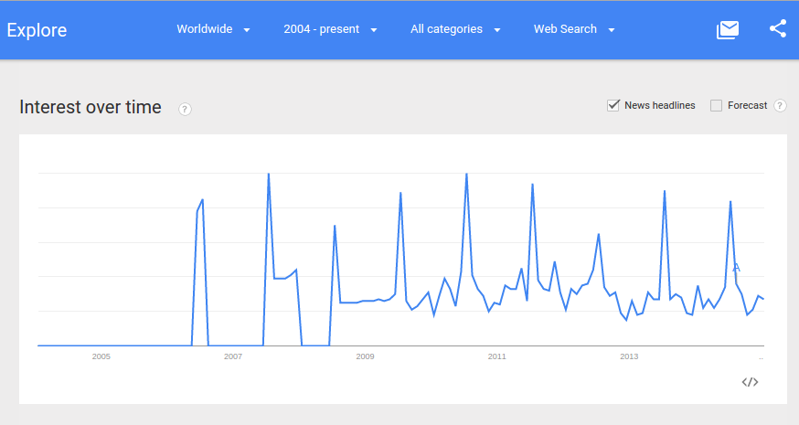
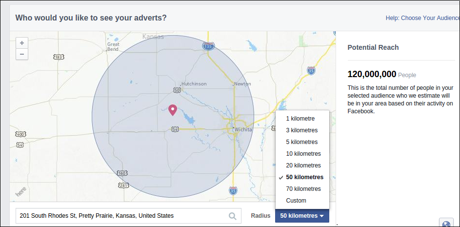
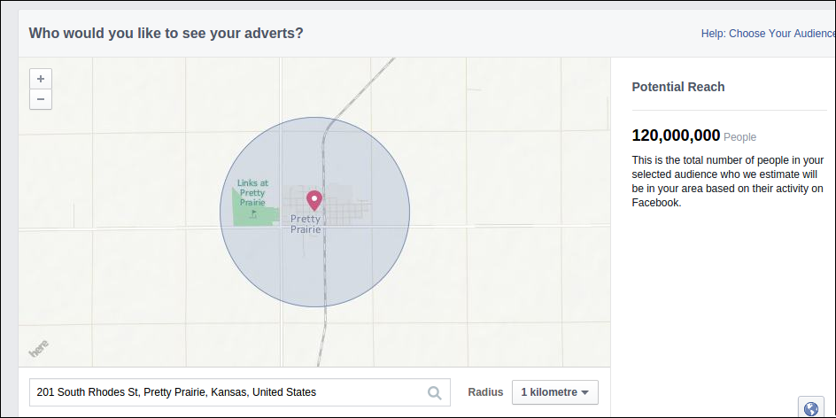
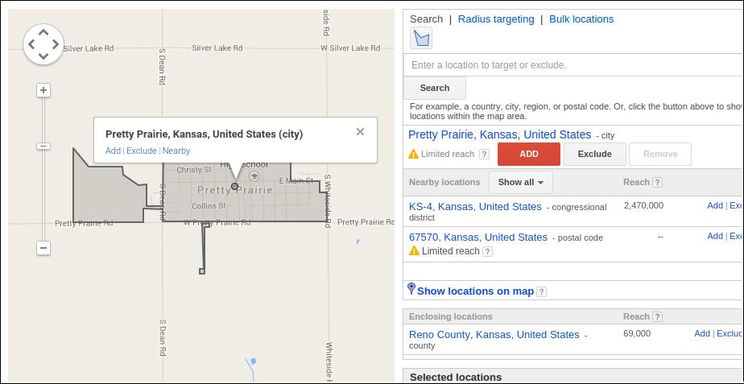

# Research Sprint

Helpful Resource: [Questions to Ask Before Starting User Research](http://www.gv.com/lib/questions-to-ask-before-starting-user-research) by Google Ventures.

## How Can the Church Remain Vital?

Pretty Prairie tends to be a very quiet place, except for every July when Pretty Prairie hosts the world famous 
[Pretty Prairie Rodeo](http://www.pprodeo.com) (the largest night rodeo in Kansas). The spikes in the Google Trends search interest graph below for phrase ["Pretty Prairie" (region: worldwide)](http://www.google.com/trends/explore#q=pretty%20prairie) all happened in July. 

## Whom Should the Church Reach?

## How Should the Church Reach Them?

### Traditional Outreach

* Up to date marketing materials (newsletter, bulletin, email signature, ect.)
* Word of mouth/visit/call/letter
* Local newspaper (permanent ad and special occasions)
* Ads and fliers in high traffic locations

### Digital Outreach

#### Church Administered
* Website
* Facebook Page

#### National United Methodist Church Administered

* Find-a-Church

#### Search Engine Optimization (SEO)

* [Search Engine Optimization](http://en.wikipedia.org/wiki/Search_engine_optimization) (SEO)

#### Google+ and Google Rich Snippets
* [Google+](https://plus.google.com/)
* [Google Rich Snippets](https://support.google.com/webmasters/answer/99170?hl=en)

#### Facebook Sharing Amongst Friends

#### [Facebook Advertising](https://www.facebook.com/business/products/ads) (Pay)

Suggested target audience ranging from a radius of 50 km around Pretty Prairie... 

Down to 3 km or 1km (shown here)... 

#### [Google AdWords](https://www.google.com/adwords) (Pay) 

Google Adwords targeting Pretty Prairie 

#### [Twitter Advertising](https://ads.twitter.com) (Pay)

#### Email Management

* [MailChimp](http://mailchimp.com)

### Advanced Marketing (Webmaster)

* [Google Webmaster](http://www.google.com/intl/en-US/webmasters)
* [Google Analytics](http://www.google.com/analytics)
* [Yahoo and Bing Webmaster](http://www.bing.com/toolbox/webmaster)
* [Google AdSense](http://www.google.com/adsense)

* [Facebook OpenGraph](http://ogp.me)
* [Twitter Cards](https://dev.twitter.com/cards/overview)
* [Twitter Intents](https://dev.twitter.com/web/intents)
* Share Buttons ([AddThis](http://www.addthis.com)/[ShareThis](http://www.sharethis.com))

## The "Business" Problem

* Dwindling, predominantly older adult local population 
* Changing lifestyles (digital and philosophical reorganization)
* Four churches in close proximity

## The "Business" Opportunity

* Decreasing importance of physical proximity
* Larger potential user base
* More channels than ever to reach people
* Untapped digital resources

#### Geographic and Demographic Info

Pretty Prairie, in central Kansas, west of Wichita, north of Kingman, south of Hutchinson, near the Amish community of Yoder, and the host of the world famous Pretty Prairie Rode (the largest night rodeo in Kansas), every July.

##### Nielson Company Demographic Info

Through the national United Methodist Church Communications Office, I obtained the most recent Nielson Company demographic info for the city of Pretty Prairie, Kansas. 

Pretty Prairie [Area Map](https://drive.google.com/file/d/0B02bpu7HZwJRaVp5dGNMOUpYbU0/view?usp=sharing)

[Executive Summary](https://drive.google.com/file/d/0B02bpu7HZwJRMFJTM3BWZXprbWM/view?usp=sharing)

[Household Trends](https://drive.google.com/file/d/0B02bpu7HZwJRV1dnSGplRUxmMDg/view?usp=sharing)

[Pop-Facts: Census Demographic Overview 2014 Report](https://drive.google.com/file/d/0B02bpu7HZwJRSHFwVm5kX0FHMmc/view?usp=sharing)

[Population by Age and Race Trend 2014](https://drive.google.com/file/d/0B02bpu7HZwJRelJTXzd1XzVWUE0/view?usp=sharing)

