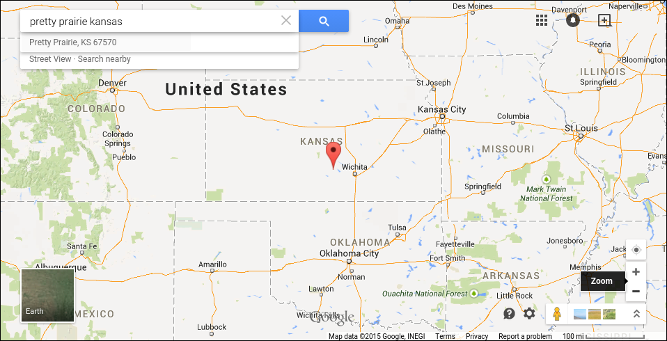
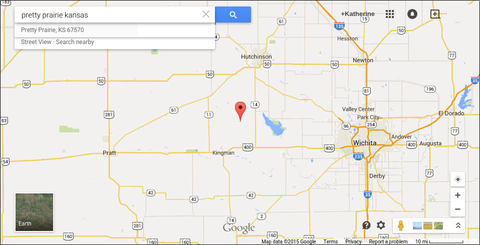

# Research Sprint

## Demographic Info

Pretty Prairie, Central Kansas, West of Wichita

North of Kingman, South of Hutchinson, near the Amish community of Yoder

Through the national United Methodist Church, I obtained the most recent Nielson Company demographic info for the city of Pretty Prairie, Kansas. 

Important points:

Pretty Prairie [Area Map](https://drive.google.com/file/d/0B02bpu7HZwJRaVp5dGNMOUpYbU0/view?usp=sharing)

[Executive Summary](https://drive.google.com/file/d/0B02bpu7HZwJRMFJTM3BWZXprbWM/view?usp=sharing)

[Household Trends](https://drive.google.com/file/d/0B02bpu7HZwJRV1dnSGplRUxmMDg/view?usp=sharing)

[Pop-Facts: Census Demographic Overview 2014 Report](https://drive.google.com/file/d/0B02bpu7HZwJRSHFwVm5kX0FHMmc/view?usp=sharing)

[Population by Age and Race Trend 2014](https://drive.google.com/file/d/0B02bpu7HZwJRelJTXzd1XzVWUE0/view?usp=sharing)

## Identifying the Problem and Opportunity

Helpful resource: the [Google Ventures Questions to Ask Before Starting User Research](http://www.gv.com/lib/questions-to-ask-before-starting-user-research) 

### The "business" problem

* Dwindling local population 
* Predominantly middle age and older local population
* Four churches in close proximity
* Increasingly digital lifestyles

### The "business" opportunity
 
* Untapped potential via modernization
* More channels than ever to reach people
* Greater accessibility of resources and knowledge
* Decreasing importance of physical proximity
* Larger potential user base
 
### Leverage

* What questions do you want to answer?
* What features/tasks do you want to test?

Existing research, analytics

Notes from previous church strategy meetings
