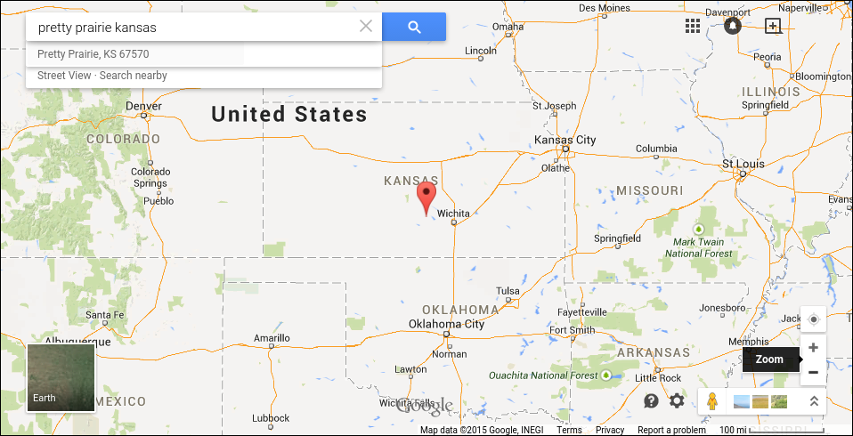

# Research Sprint

# Reverse Engineering

The idea for reverse engineering came from this article:

Helpful Resource: [Questions to Ask Before Starting User Research](http://www.gv.com/lib/questions-to-ask-before-starting-user-research) by Google Ventures.

## Pretty Prairie United Methodist Church Mission Statement

"To glorify God by sharing the love of God, the teachings of Jesus Christ and the power of the Holy Spirit within our community"

## What Does a Successful Local Church Look Like?

### The "Business" Problem

* Changing lifestyles (digital and philosophical reorganization)
* Dwindling, predominantly older adult local population 
* Four churches in close proximity

Pretty Prairie, in central Kansas, west of Wichita, north of Kingman, south of Hutchinson, near the Amish community of Yoder.

### Whom Should the Church Reach?

### Nielson Company Demographic Info

Through the national United Methodist Church Communications Office, I obtained the most recent Nielson Company demographic info for the city of Pretty Prairie, Kansas. 

Pretty Prairie [Area Map](https://drive.google.com/file/d/0B02bpu7HZwJRaVp5dGNMOUpYbU0/view?usp=sharing)

[Executive Summary](https://drive.google.com/file/d/0B02bpu7HZwJRMFJTM3BWZXprbWM/view?usp=sharing)

[Household Trends](https://drive.google.com/file/d/0B02bpu7HZwJRV1dnSGplRUxmMDg/view?usp=sharing)

[Pop-Facts: Census Demographic Overview 2014 Report](https://drive.google.com/file/d/0B02bpu7HZwJRSHFwVm5kX0FHMmc/view?usp=sharing)

[Population by Age and Race Trend 2014](https://drive.google.com/file/d/0B02bpu7HZwJRelJTXzd1XzVWUE0/view?usp=sharing)

### How Should the Church Reach Them?

#### "How might we"

Members of the Nurture, Outreach, Witness (NOW) Committee would begin to collaborate on a new church marketing plan. In preparation for their group work, I provided the NOW Committee with an example plan, a [Marketing Plan Worksheet](http://s3.amazonaws.com/Website_Properties_UGC/market-your-church/documents/UMCOM_YOUR_MARKETING_PLAN_WORKSHEET.PDF), and a ["Tactics" List](http://s3.amazonaws.com/Website_Properties_UGC/market-your-church/documents/STEP_4_IMPLEMENTATION_HOMEWORK.PDF) taken from the [United Methodist Communications](http://www.umcom.org) [Marketing Audit](http://www.umcom.org/learn/market-your-church-getting-started). 

See [New Marketing Strategy](new_marketing_strategy.md) for the finished result. 

## What Does a Successful National Church Look Like?

### Whom Should the Church Reach?

### How Should the Church Reach Them?

