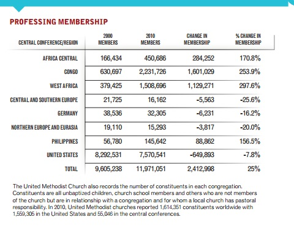
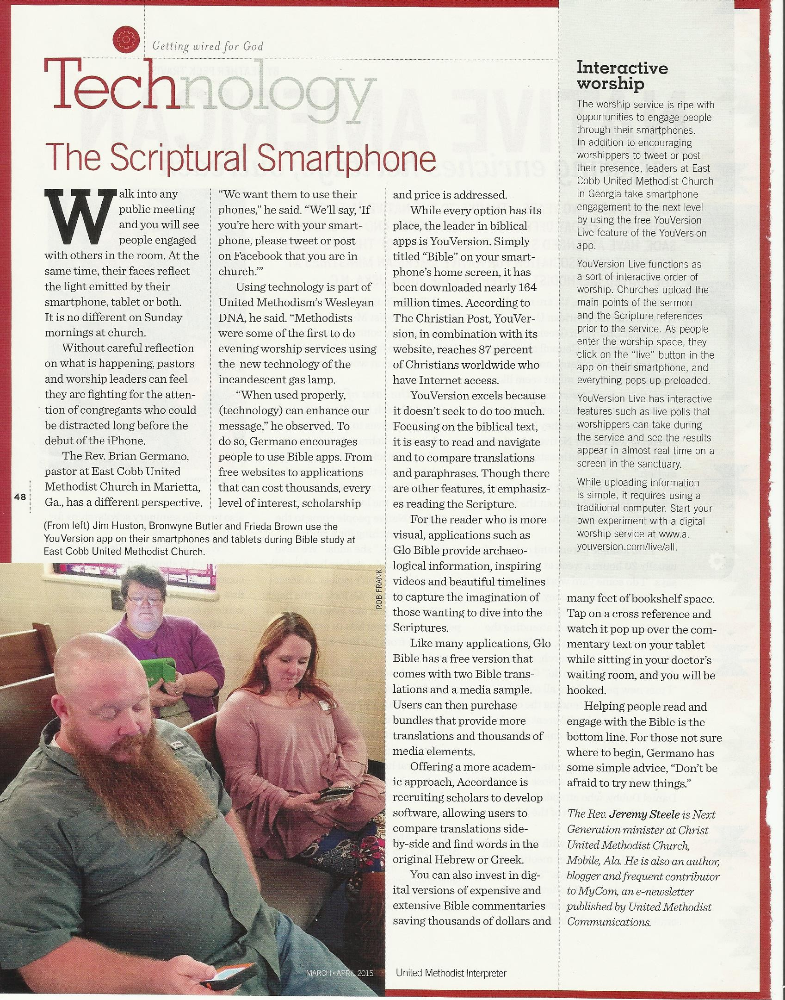
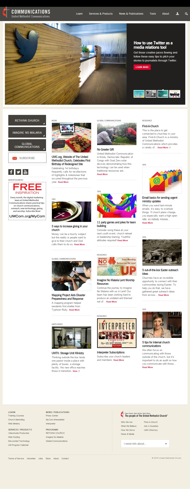
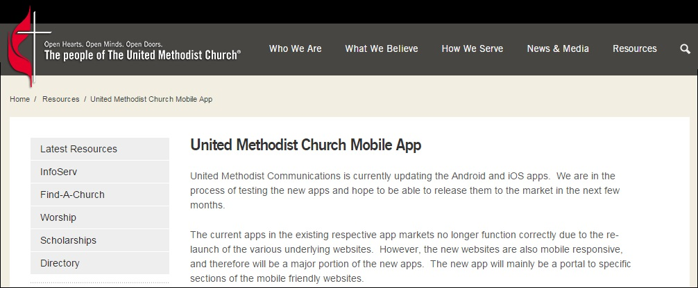

# Research Sprint
What's the matter with the [United Methodist Church](http://www.umc.org)? Looking at the steady decline of interest in the United Methodist Church and how it can be fixed.

## Reverse Engineering for Success
The questions I seek to answer in my research sprint:
* Whom should the church reach?
* How should the church reach them?
* What does a successful national United Methodist Church digital presence look like?

# Whom Should the Church Reach?

## Google Trends Graph for "United Methodist Church"

Google Trends graph for the phrase ["United Methodist Church" (region: worldwide)](http://www.google.com/trends/explore#q=United%20Methodist%20Church), from around 2004 to 2015. 

This declining search interest traffic was almost 100% from the United States. 

## Declining United Methodist Membership in the U.S.

According to the [2012 United Methodist State of the Church Report](http://s3.amazonaws.com/Website_Properties/state-of-the-church/documents/2012-state-of-the-church-report.PDF) (the latest report of its kind), between 2000 and 2010, United Methodist membership in the United States declined by 7.8%.  

## Declining Interest in Mainline Churches

This problem of declining interest is not exclusive to the United Methodist Church. Mainline churches in general are struggling to stay relevant. 

Google Trends graph for the phrases ["United Methodist" "Catholic" "Presbyterian" "Baptist" (region: worldwide)](http://www.google.com/trends/explore#q=United%20Methodist%2C%20Catholic%2C%20Presbyterian%2C%20Baptist&cmpt=q&tz=), from around 2004 to 2015:

## Increasing United Methodist Membership in Developing Countries

According to the [2012 United Methodist State of the Church Report](http://s3.amazonaws.com/Website_Properties/state-of-the-church/documents/2012-state-of-the-church-report.PDF), though membership is on the decline in the United States, between 2000 and 2010, membership has gone up 25% worldwide, due to skyrocketing membership in parts of Africa and the Philippines.

| Region | % Change in Membership, Highest to Lowest, 2000-2010 |
| -- | -- |
| West Africa | 297.6% |
| Congo | 253.9% |
| Africa Central | 170.8% |
| Philippines | 156.5% |
| United States | -7.8% |
| Germany | -16.2% |
| Northern Europe and Eurasia | -20% |
| Central and Southern Europe | -25.6% |
| Total Change | +25% |

| Region | Total Membership in 2010 |
| -- | -- |
| U.S. | 7,570,541 (down by -649,893) |
| African regions | 4,191,108 (up by 3,014,552) |
| Philippines | 145,642 (up by 88,862) |
| Europe and Eurasia | 63,760 (down by 15,611) 
So, even though the U.S. has the largest percentage of United Methodist members, this number is steadily stagnating. Meanwhile, membership in Africa threatens to overtake that of the United States. Philippines growth is big percentage-wise though considerably smaller than that of Africa in comparison. Membership in Europe and Euroasia is declining, but already small. 

Projected membership by 2020, using same percentage change as 2000 to 2010

| Region | Projected Membership, 2020 |
| -- | -- |
| U.S. | 6,980,038 | 
| Africa | 14,920,344 | 
| Philippines | 227,929 |

At this rate, Africa will have more than doubled the U.S. in United Methodist membership by 2020. And there is room for much more growth since Africa has a population of 1+ billion. Though of course the United Methodist Church would seek to minister to people anywhere in the world, clearly the religion is more popular in some regions than others. 

# How should the church reach them?

## Software is Eating the World
[Marc Andreessen](https://twitter.com/pmarca) famously explained his theory of [Why Software Is Eating The World](http://online.wsj.com/article/SB10001424053111903480904576512250915629460.html) in the Wall Street Journal in 2011. 

It goes like this: 
A "technological and economic shift" is happening. The world is becoming a global, digitally wired economy. The masses have growing access to personal computers, broadband, and now smartphones. Online services are increasingly more popular, becoming permanently integrated with daily habits. As demand grows, more low-cost SaaS and PaaS infrastructure products (Amazon Web Services, Heroku, Digital Ocean, ect.) are being offered that enable entrepreneurs to launch online businesses by renting micro-instances of infrastructure, and pay as they go, unlike in the past, when businesses had to spend five, six, seven figures or more for the full computer infrastructure equipment needed to keep a business up and running. Suddenly, incumbent moats, barriers of entry of ago are becoming a thing of the past. A couple of agile software developers working out of an apartment can write the software needed to create a global business that threatens a slower-moving, large-scale, established incumbent business. This happened in the case of Amazon, and many others. Even companies with previously no connection at all to software are being "eaten by software," as more services are being delivered (and expected to be delivered) online. 

"Companies in every industry need to assume that a software revolution is coming... in many industries, new software ideas will result in the rise of new Silicon Valley-style start-ups that invade existing industries with impunity. Over the next 10 years, the battles between incumbents and software-powered insurgents will be epic." 
-Marc Andreessen

## Mobile is Eating the World
The "Software is Eating the World" theory was revisted in 2014 by [Marc Andreessen](https://twitter.com/pmarca) and his investing partner [Ben Horowitz](https://twitter.com/bhorowitz) in the a16z podcast: "[Ben and Marc Explain (Practically) Everything – Part 1](http://a16z.com/2014/08/25/a16z-podcast-ben-and-marc-explain-practically-everything-part-1)," this time with a focus on the "Mobile is Eating the World," theory also illustrated by this [slidedeck](http://a16z.com/2014/10/28/mobile-is-eating-the-world) by a16z partner Benedict Evans.

Marc Andreessen: "Starting in 2007, with the iPhone, the smartphone comes out. The smartphone finally packages computers in a form where everybody on the planet can have one... I think everybody on the planet by the end of the decade is going to have a smartphone. Effectively everybody. Almost everybody. Including in places where it’s still hard to get electricity or water, people are going to have smartphones... So, I think we’re going to live in a world by the end of the decade in which there’s five, six, seven billion smartphones in people’s hands, which means five, six, seven billion people in the world connected to the Internet with what we would consider modern tools and technologies and access... I think the next five years is basically prime time to think about every business, every industry, every field and say, “Well, how can we reinvent it now knowing that software can basically play such an important role in everything.”

### iPhone Launches and Mobile Takes Off
The launch of the iPhone and subsequent popularity of other mobile products can be clearly seen in the graph below. Words associated with mobile ("iPhone" "app" "Android") are up and to the right. Non-mobile words ("desktop" "website") are on the decline.

Google Trends graph for phrases ["iPhone" "app" "Android" "desktop" "website" (region: worldwide)](http://www.google.com/trends/explore#q=iPhone%2C%20app%2C%20Android%2C%20desktop%2C%20website&cmpt=q&tz=), from 2004 to 2015. 

Also, when the iPhone launched, a market for church-related mobile products was immediately born, as illustrated in the Google Trends graph below.

Google Trends graph for phrases ["church iPhone" "church app" "church Android" "church desktop" "church website" (region: worldwide)](http://www.google.com/trends/explore#q=church%20iPhone%2C%20church%20app%2C%20church%20Android%2C%20church%20livestream&cmpt=q&tz=), from 2004 to 2015.

## Increasing Mobile Phone Ownership in Developing Countries
"In the next 10 years, I expect at least five billion people worldwide to own smartphones, giving every individual with such a phone instant access to the full power of the Internet, every moment of every day." -Marc Andreessen

United Methodist membership is skyrocketing in developing countries where the people may not be able to afford a laptop, but perhaps can afford a smartphone as the price falls. Such a phone will be used for education, banking, to own a small business, to connect with other people from around the world, and perhaps to read the Bible. The phone may be the first and only computer that the person has ever owned.  

6x more mobile phone subscriptions in developing world

It should be noted that even though smartphones are becoming popular worldwide, different phones are popular among different demographics and regions. For example, in comparison to Android, iPhones tend to be more expensive and fewer are sold. However, their owners typically spend more money, which is one of the reasons why many business in the developed world develop for iPhone "first." People in a developing country may be less likely to be able to afford an iPhone. So organizations that intend to be successfully adopted in a developing country my need to develop for inexpensive platforms first in order to offer products the people there can afford. As an example, the messaging company WhatsApp developed for a variety of inexpensive platforms and made its mobile app free for a year. WhatsApp achieved widespread adoption and success.

## Software is Reorganizing the World

Balaji Srinivasan ([@balajis](https://twitter.com/balajis)) famously [wrote](http://www.wired.com/2013/11/software-is-reorganizing-the-world-and-cloud-formations-could-lead-to-physical-nations)... 

"It is not immediately obvious where those seeking opportunity might head today. Every square foot of earth is already spoken for by one (or more) nation states, every physical frontier long since closed.

With our bodies hemmed in, our minds have only the cloud — and it is the cloud that has become the destination for an extraordinary mental exodus. Hundreds of millions of people have now migrated to the cloud, spending hours per day working, playing, chatting, and laughing in real-time HD resolution with people thousands of miles away … without knowing their next-door neighbors.

Though the separation between our bodies is still best characterized by the geographical distance between points on the surface of the earth, the distance between our minds is increasingly characterized by a completely different metric: the geodesic distance, the number of degrees of separation between two nodes in a social network. 

Perhaps the single most important feature of these states of mind is the increasing divergence between our social and geographic neighbors, between the cloud formations of our heads and the physical communities surrounding our bodies. An infinity of subcultures outside the mainstream now blossoms on the Internet — vegans, body modifiers, CrossFitters, Wiccans, DIYers, Pinners, and support groups of all forms. Millions of people are finding their true peers in the cloud, a remedy for the isolation imposed by the anonymous apartment complex or the remote rural location."

# What Does a Successful National United Methodist Church Digital Presence Look Like?

Using the theories of Software is Eating the World, Mobile is Eating the World, and Software is Re-Organizing the world, we can surmise that going into the fuutre, the world will be a place largely automated by software. Though desktop computers will not go away, people the world over will own smartphones. These smartphones will be remote controls in life. They will be portals into the online world, where we will interact with others "in the cloud," while simultaneously living our physical existence.  

Going into the future, many of the most successful organizations will be those that leverage the power of mobile to create a network effect. 

## To What Extend Can a Different Tech Approach Help?
Is this decline in global United Methodist membership a result of changes in lifestyle, or apathy toward the religion itself? To what extent can a drastic change in technology approach turn the situation around? In the case of apathy, presumably a change in technology will approach will do little to help, because technology is not at the root of the problem. 

The answer might be found by taking a look at the success of LifeChurch. LifeChurch's Google Trends Graph results are up and to the right.

Positive, also due to fundraising

Laura Andreessen article

Some fear people will not go to church because of digital products. On the other hand, church is a competitive marketplace. Seekers can find other digital products as replacements.

### [Google Trends Graph for Phrases "United Methodist Church" "LifeChurch" "The Bible App" "Upworthy"](http://www.google.com/trends/explore#q=United%20Methodist%20Church%2C%20LifeChurch%2C%20The%20Bible%20App%2C%20Upworthy&cmpt=q&tz=) from 2004 to 2015

The United Methodist Church, which is clearly of declining interest, is still a "giant" compared to Upworthy at Upworthy's peak search volume. LifeChurch and The Bible App are miniscule in comparison, but on the rise and with a strong, modern network effect in place of the sort that could disrupt traditional church.

### Surviving Disruption

In the article [Surviving Disruption](https://hbr.org/2012/12/surviving-disruption), Max Wessel and Clayton Christensen explain how a company can disrupt itself in order to avoid being disrupted:

* Identify the strengths of your disrupter’s business model
* Identify your own relative advantages
* Evaluate the conditions that would help or hinder the disrupter from co-opting your current advantages in the future.

## Survival
According to the [2012 United Methodist State of the Church Report](http://s3.amazonaws.com/Website_Properties/state-of-the-church/documents/2012-state-of-the-church-report.PDF), "Critical research conducted in 2010 found that 15 percent of United Methodist congregations in the United States were considered 'highly vital.' As a result, the Connectional Table and the Council of Bishops embraced a 10-year adaptive challenge to increase vitality across the denomination, especially in places where churches have been on the decline... Because of this Spirit-filled movement, the 2012 State of the Church Report focuses on vital congregations. Annual conferences and congregations in our worldwide connection are finding new ways to share the Good News of Jesus Christ, revitalizing the United Methodist movement in places of need. We praise God and celebrate the growth and vitality of our churches in Africa and the Philippines and will continue to find ways to strengthen our global connection"

http://www.umcdiscipleship.org/worship
http://www.umcdiscipleship.org/drint
http://www.umcdiscipleship.org/new-church-starts

## Critique of [umc.org](http://www.umc.org) 

The website has an appealing design. The color scheme is a nod to the United Methodist cross and flame logo and the colors are repeated throughout the website. The layout is appealing, including a "carousel" of photos "above the fold" and a newspaper like homepage below, all designed to attract attention. The main shortcoming of the United Methodist online presence is the convoluted nature of the content. 

## Jesus and John Wesley, Social Pioneers

Maybe the United Methodist Church need look no further than [social network](http://en.wikipedia.org/wiki/Social_network) pioneers Jesus and John Wesley for inspiration. 

Jesus grew a social network that consisted of family, friends, and followers, who spread his message by word of mouth until it became viral the world over. 

[John Wesley](http://en.wikipedia.org/wiki/John_Wesley) spread the Methodist religion across the United States by creating a social network of followers who were organized into "Class Meetings" across geographic territories and ministered to by "Circuit Riders." 

"I look upon all the world as my parish" -John Wesley, founder of Methodism

