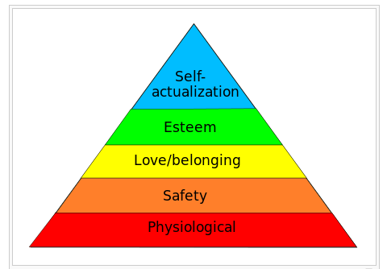

# Reverse Engineering for Success

## Disruption
Remember the story of David and Goliath? Just like David killed Goliath by finding Goliath's achilles heel, as software eats the world, tech startups are finding the achilles heels of their less agile incumbent competitors. 

## What the Church Can Learn from The Bible App and Upworthy 

### The Bad News
It appears that in order to effectively compete, the United Methodist Church needs to repackage its message and how it is delivered. 

Business opportunities that could be exploited are being overlooked and/or passed over. I suspect that what is preventing the United Methodist Church from adequately disrupting itself is: 

* Lack of knowledge/foresight
* Pre-existing assumptions
* Limited resources

The longer the church takes to disrupt itself, the harder it may be due to [Network Effect](http://en.wikipedia.org/wiki/Network_effect) and the [Law of Accelerating Returns](http://en.wikipedia.org/wiki/Accelerating_change). 

### The Good News

The success of The Bible App and Upworthy shows that there can be a thriving market for religious and uplifting content. 

### Competitor Idea Maze

The organizations that stay relevant, will not be the ones that are the most pious. They will be the ones that adapt the fastest, and the best, and achieve a network effect. 

The church should not exactly aspire to copy The Bible App or to be like Upworthy. The church should use case studies such as these to extract knowledge that can be applied to reach a similar popularity, but within the context appropriate to the United Methodist Church. 

## Digital and Philosophical Reorganization

## Maslow's Hierarchy of Human Needs
A theory of human motivation

### [Software is Eating the World](http://online.wsj.com/article/SB10001424053111903480904576512250915629460.html)

Marc Andreessen ([@pmarca](https://twitter.com/pmarca)) famously wrote.... 

### Mobile is Eating the World

#### Google Trends Graph for Phrases "iPhone" "app" "Android" "desktop" "website"

Google Trends graph for phrases ["iPhone" "app" "Android" "desktop" "website" (region: worldwide)](http://www.google.com/trends/explore#q=iPhone%2C%20app%2C%20Android%2C%20desktop%2C%20website&cmpt=q&tz=), from 2004 to 2015. Words associated with mobile ("iPhone" "app" "Android") are up and to the right. Non-mobile words ("desktop" "website") are on the decline.

http://www.google.com/trends/explore#q=church%20iPhone%2C%20church%20app%2C%20church%20Android%2C%20church%20livestream&cmpt=q&tz=

### Mobile Leap-Frogging Desktop in Developing Countries 

 In some developing countries, a mobile phone may be the first and only "computer" people can afford, which is perhaps why many of the countries recording the highest levels of Google Trends search interest for [The Bible App](the_bible_app_case_study.md) are African countries. 
 
### [Software is Reorganizing the World](http://www.wired.com/2013/11/software-is-reorganizing-the-world-and-cloud-formations-could-lead-to-physical-nations)

Balaji Srinivasan ([@balajis](https://twitter.com/balajis)) famously wrote... 

Physical proximity limits outreach. Physical proximity is decreasing in importance. More people than ever can be reached all over the world via the internet in real time. 

