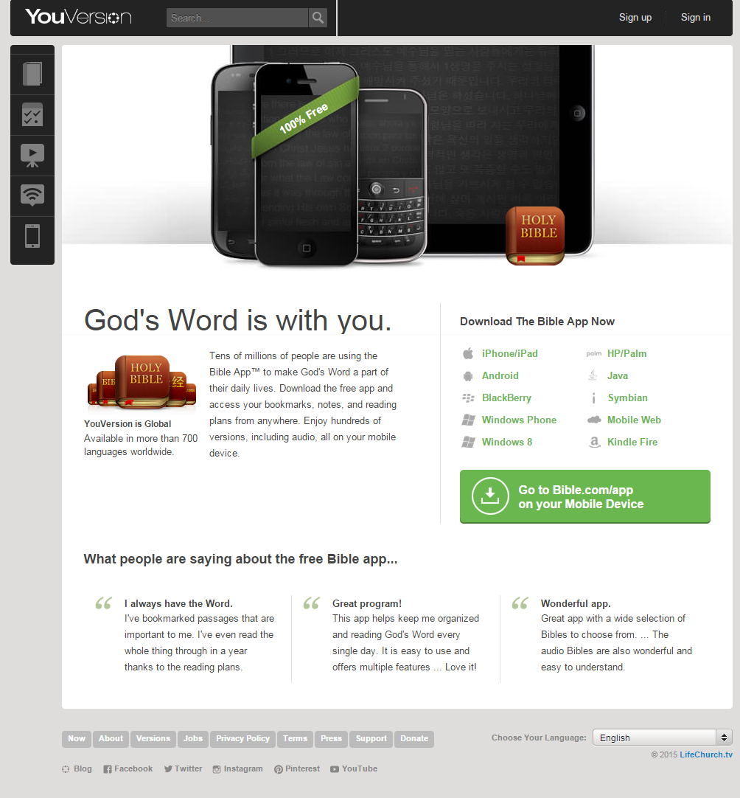

# The Bible App Case Study

How has a religious app achieved [100 million+ downloads](http://www.businessinsider.com/youversion-bible-app-has-100-million-downloads-2013-7), with popularity remaining steadily high?

## Google Trends Graph for Phrase "Bible App"

Google Trends graph for the phrase ["Bible App" (region: worldwide)](http://www.google.com/trends/explore#q=Bible%20App), from 2004 to 2015. [The Bible App](https://www.bible.com/app) was founded in 2008.  

Regional interest

1. Ghana
2. Kenya
3. Nigeria
4. South Africa
5. Philippines
6. United States
7. Singapore

(Two [developed countries](http://en.wikipedia.org/wiki/The_World_Factbook_list_of_developed_countries) (South Africa and U.S.), most predominantly [Christian](http://en.wikipedia.org/wiki/Religious_information_by_country) with Nigeria and Singapore exceptions, all high on [number of mobile phones in use](http://en.wikipedia.org/wiki/List_of_countries_by_number_of_mobile_phones_in_use))

## LifeChurch.tv "[Who We Are](http://www.lifechurch.tv/who-we-are)"

"A church isn't a building—it's the people. We meet in locations around the United States and globally online." -LifeChurch.tv

## Products

### [The Bible App](https://www.bible.com/app)

#### Purpose
Use desktop and mobile devices to:
* Read the Bible
* Share Bible verses on social networks
* Bookmark favorite passages

#### Platforms
Available on all major platforms and more: 
* iPhone/iPad
* Android
* Mobile Web
* Kindle Fire
* Blackberry
* Windows Phone
* Windows 8
* HP/Palm

And others...

### [The Bible App for Kids](https://www.bible.com/kids)

Made in partnership with [OneHope](http://onehope.net/feature/bibleappforkids)

#### Purpose

#### Platforms

## Corporate Structure 

Non-profit

## Business Model

Networktv- like a Franchise

http://techcrunch.com/2012/05/10/bible-youversion-lifechurch

http://www.lifechurch.tv/giving

http://www.lifechurch.tv/digital-missions

https://s3.amazonaws.com/lctv-site/downloads/giving/Giving-Financial-Statements-2014-Unaudited-Updated.pdf

http://live.lifechurch.tv/

