# Upworthy Case Study

### Google Trends

A technique that I've learned from the tech analysts [I follow on Twitter](https://twitter.com/katimichel/following) is to use [Google Trends](http://www.google.com/trends) to gauge the level of interest in a word (or words), including by region. 

### Google Trends for "Pretty Prairie"

Unfortunately, Google Trends does not go into enough detail to give results for "Pretty Prairie United Methodist Church," but here is a fun graph for the results for ["Pretty Prairie" (region: worldwide)](http://www.google.com/trends/explore#q=pretty%20prairie), from around 2004 to September 2004; The town of Pretty Prairie, Kansas happens to host the world famous [Pretty Prairie Rodeo](http://www.pprodeo.com) (the biggest night rodeo in Kansas) every July. The spikes in the Google Trends graph below all happened in July :) 

The Google Trends graph for "[Pretty Prairie Rodeo" (region: worldwide)](http://www.google.com/trends/explore#q=%22pretty+prairie+rodeo%22) demonstrates similar spikes in interest. 

### Google Trends for "United Methodist Church"

Unfortunately, the Google Trends graphs for the search phrase "United Methodist Church" are not so fun, because they show a steady decline in search interest. 

Here is the Google Trends graph for the phrase ["United Methodist Church" (region: worldwide)](http://www.google.com/trends/explore#q=united%20methodist%20church), from around 2004 to January 2015: 

Here is the Google Trends graph for the phrase ["United Methodist Church" (region: Kansas)](http://www.google.com/trends/explore#geo=US-KS&q=united+methodist+church), from around 2004 to January 2015: 

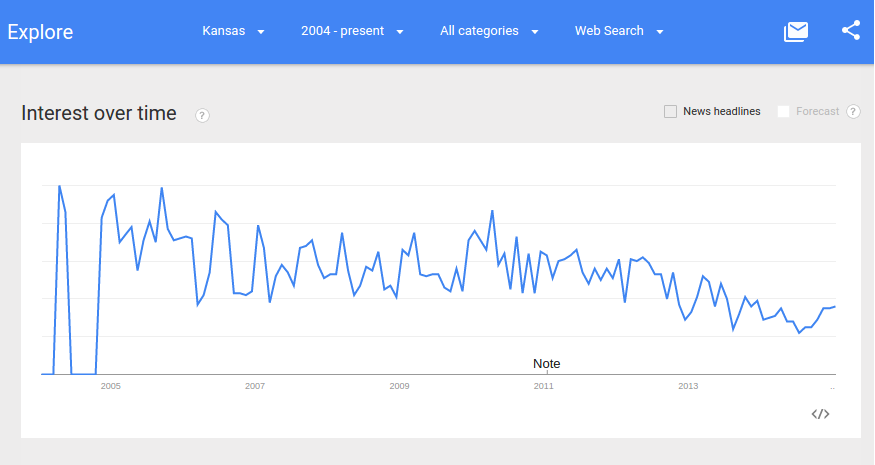

Here is the Google Trends graph for the phrase ["United Methodist Church" (region: Wichita/Hutchinson, Kansas)](http://www.google.com/trends/explore#geo=US-KS-678&q=united+methodist+church), from around 2004 to January 2015: 

### The Competition (Not Who You Might Expect)

Even as search interest in the United Methodist Church declined, in a short period of time during the past few years, a website with something of a mission for social justice called [Upworthy](http://www.upworthy.com) became "[the fastest-growing media site in history](http://www.fastcompany.com/3012649/how-upworthy-used-emotional-data-to-become-the-fastest-growing-media-site-of-all-time)," achieving growth that far surpassed that of its closest viral competitors: Buzzfeed, Huffington Post, and Business Insider. 

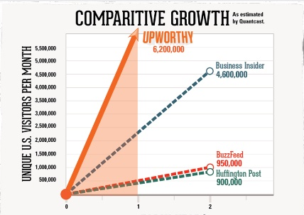

Upworthy is not affiliated with any church and as far as I know, does not intend to compete with churches. However, Upworthy became popular in part by bringing directly to the Facebook news feeds of potential church goers, some of the same type of uplifting content that in the past they would have come across in church through church mission. 

Upworthy Logo

Upworthy Footer: "Upworthy is Social Media with a Mission"
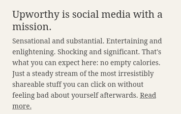

Some examples: 

This is the Google Trends graph for the phrase ["Upworthy" (region: worldwide)](http://www.google.com/trends/explore#q=upworthy), beginning when Upworthy was founded in 2012, until January 2015: 

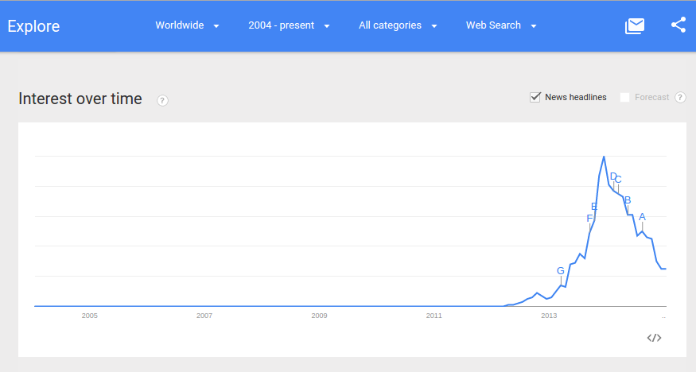

If, like me, you were a regular user of Facebook in the Fall of 2013, it's very likely that like me you came across Upworthy content regularly. Facebook has been Upworthy's main source of traffic. When Facebook changed its algorithms at the end of 2013 (reportedly in response to Upworthy's content becoming disportionately popular in the Facebook news feed), Upworthy's traffic dramatically fell. 

The success of Upworthy seems to make moot the argument that people are no longer interested in that which is uplifting. The viral competitors that Upworthy far surpassed in growth did not have the same social justice mission as Upworthy. 

### Example Upworthy Story

### The Secret of Upworthy's Success: Content Formula

So why were a record number of people attracted to Upworthy content? How did Upworthy achieve this unprecedented growth and in such a short time? Feel free to find out from [Upworthy](http://www.slideshare.net/Upworthy) itself. In a nutshell, Upworthy's content is technically and emotionally optimized to induce sharing. Here is a summary of the Upworthy approach:

 
* Comb through "evergreen" content online to identify stories that have the potential to become viral
* Enticing headlines, also called "click-bait" and generally frowned upon by respected media (Upworthy's rule of thumb is to write each headline 25 different ways, then user test to choose the best one)
* Content invoking an emotional response
* Optimization for ease of sharing via the website and the social media networks with the most traffic
* User Testing to the nth degree

### The Secret of Upworthy's Success: Website Tactics

Upworthy Homepage: Use of Endless Scrolling
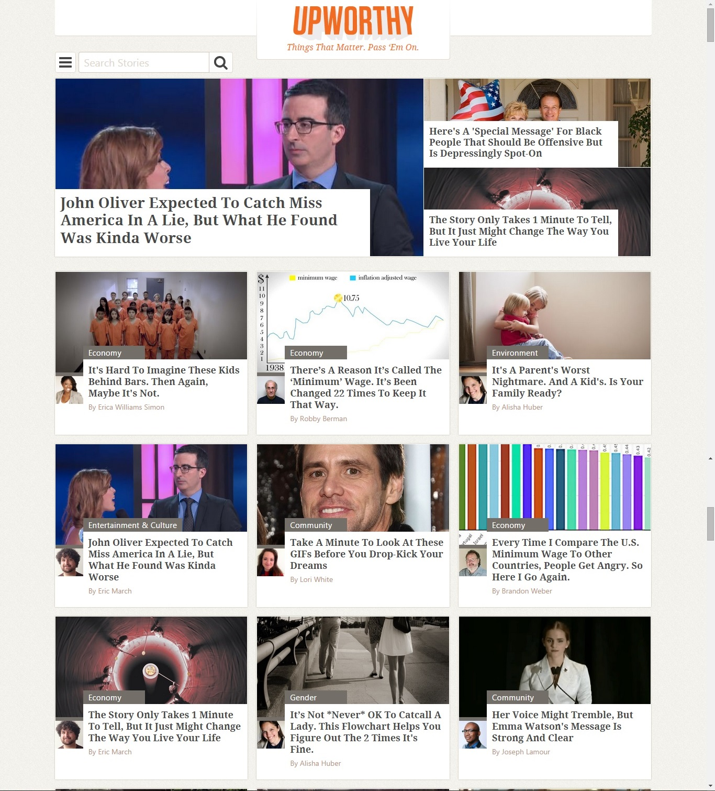

Upworthy Modal Tactic: Daily Email
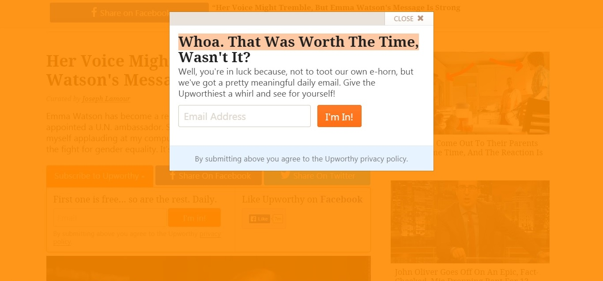

Upworthy Modal Tactic: "Ever Seen These?"
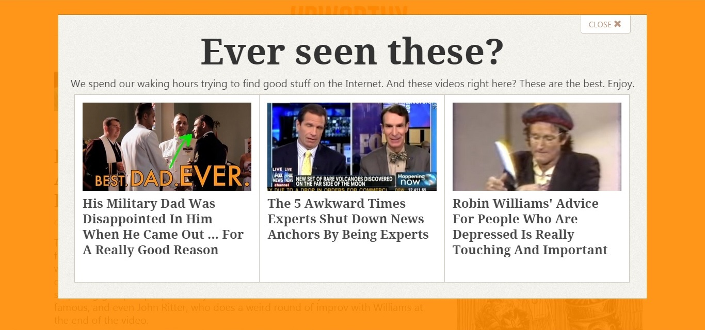

Upworthy Modal Tactic: "How About One More"

### The Secret of Upworthy's Success: High Traffic Social Media Profiles

Upworthy Facebook Page
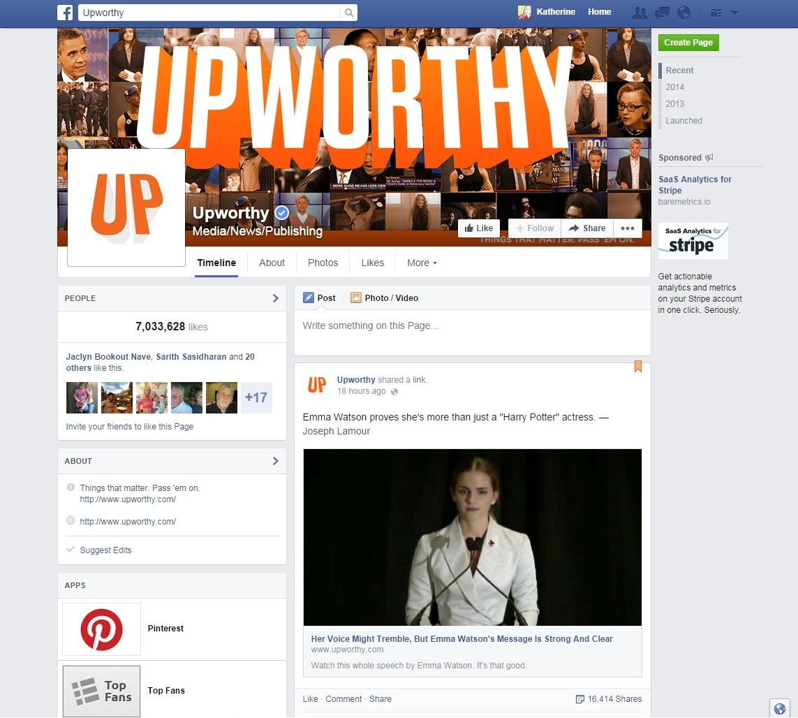

Upworthy Twitter Profile
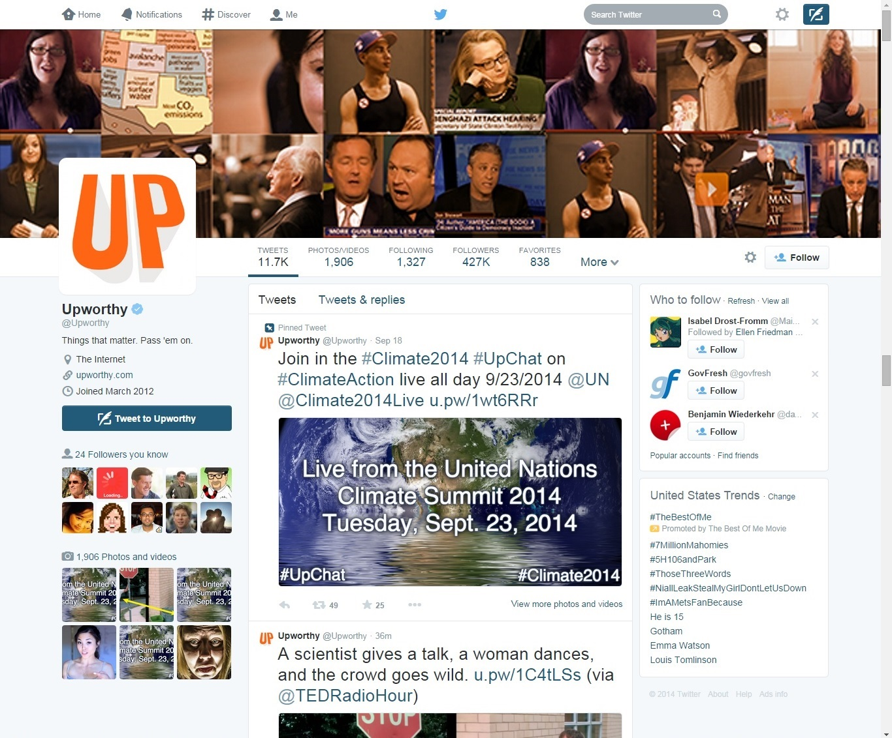

Upworthy Pinterest Profile
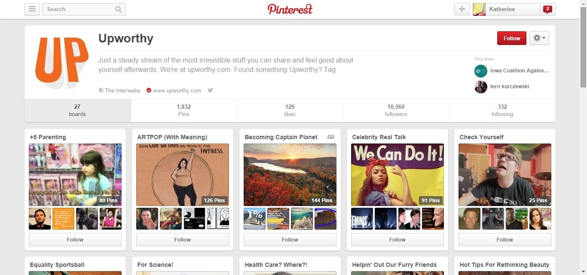

### The Secret of Upworthy's Success: Repeat Posting

Upworthy Example Article Repost #1
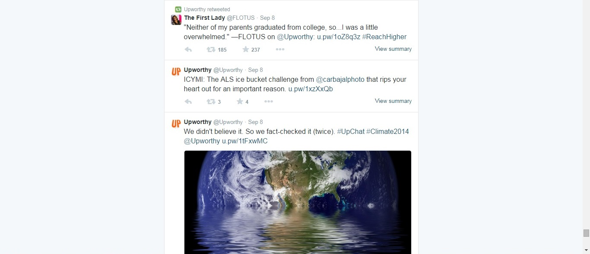

Upworthy Example Article Repost #2
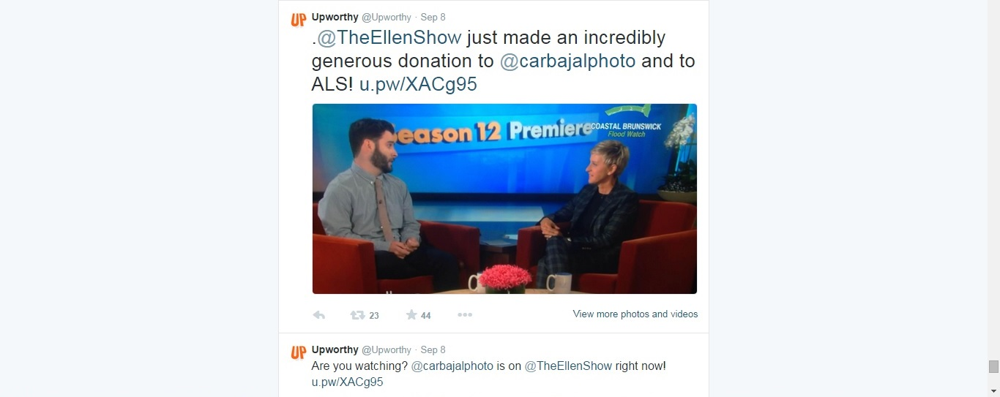

Upworthy Example Article Repost #3

### The Secret of Upworthy's Success: Viral

Upworthy Example Article Trending on Twitter
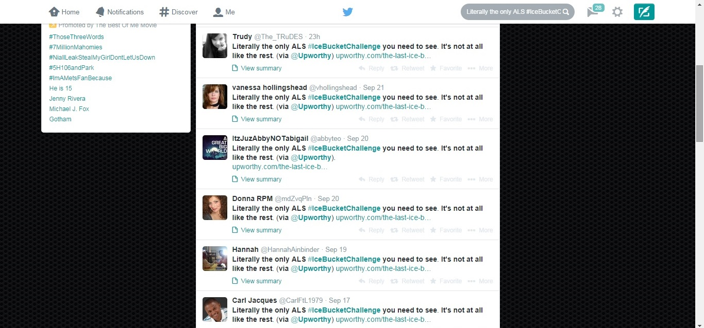

### The Changing Global Ministry Landscape and What the Church Can Learn from Upworthy

The church should not aspire to be like Upworthy. However, there is a market for "uplifting" content. The church may need to repackage its message and how the message is delivered if it is to compete for the public's attention. 

### John Wesley, Social Pioneer

Perhaps the United Methodist Church need look no further than its own founder for inspiration. 

"I look upon all the world as my parish" -John Wesley, founder of Methodism

