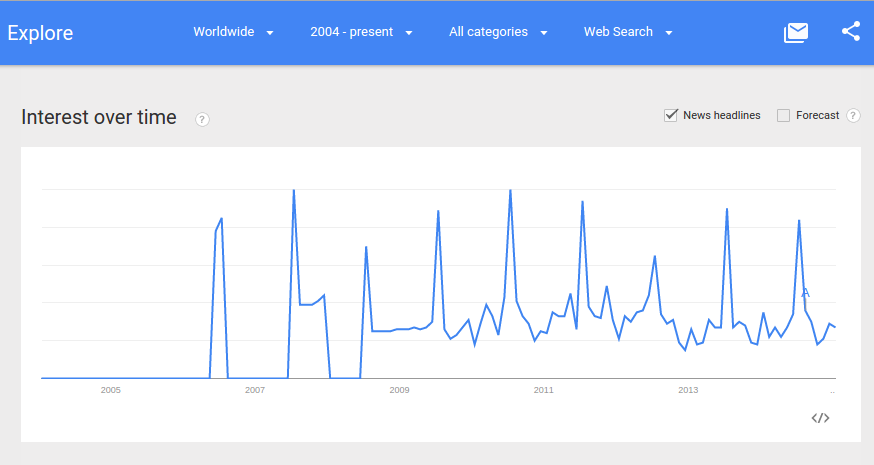
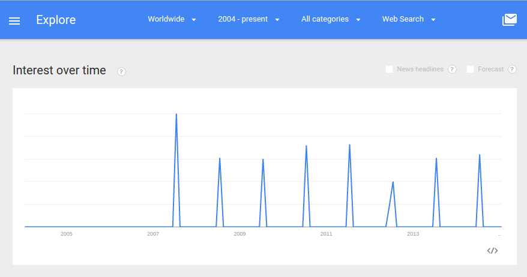
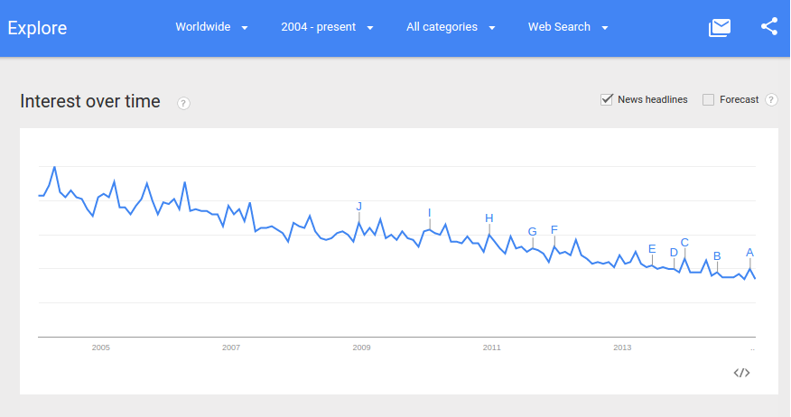
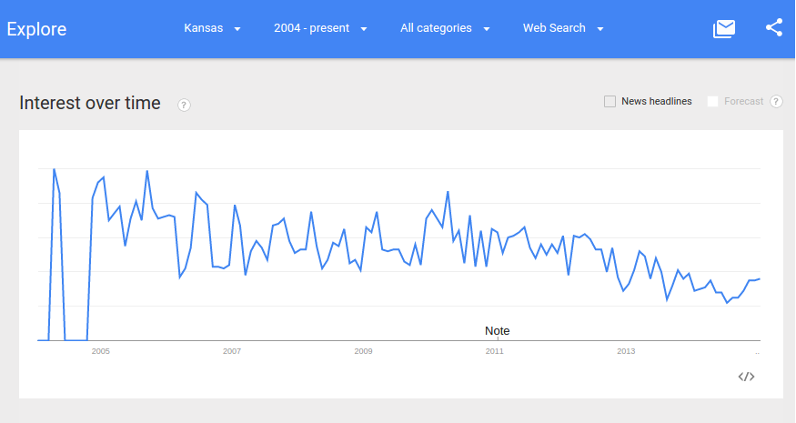
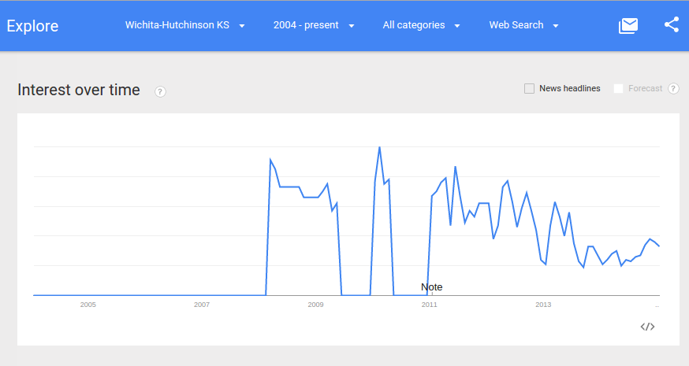

# Upworthy Case Study

### Google Trends

A technique that I've learned from the tech analysts [I follow on Twitter](https://twitter.com/katimichel/following) is to use [Google Trends](http://www.google.com/trends) to gauge the level of interest in a word (or words), including by region. 

### Google Trends for "Pretty Prairie"

Unfortunately, Google Trends does not go into enough detail to give results for "Pretty Prairie United Methodist Church," but here is a fun graph for the results for ["Pretty Prairie" (region: worldwide)](http://www.google.com/trends/explore#q=pretty%20prairie), from around 2004 to September 2004; The town of Pretty Prairie, Kansas happens to host the world famous [Pretty Prairie Rodeo](http://www.pprodeo.com) (the biggest night rodeo in Kansas) every July. The spikes in the Google Trends graph below all happened in July :) 

The Google Trends graph for "[Pretty Prairie Rodeo" (region: worldwide)](http://www.google.com/trends/explore#q=%22pretty+prairie+rodeo%22) demonstrates similar spikes in interest. 

### Google Trends for "United Methodist Church"

Unfortunately, the Google Trends graphs for the search phrase "United Methodist Church" are not so fun, because they show a steady decline in search interest. 

Here is the Google Trends graph for the phrase ["United Methodist Church" (region: worldwide)](http://www.google.com/trends/explore#q=united%20methodist%20church), from around 2004 to January 2015: 

Here is the Google Trends graph for the phrase ["United Methodist Church" (region: Kansas)](http://www.google.com/trends/explore#geo=US-KS&q=united+methodist+church), from around 2004 to January 2015: 

Here is the Google Trends graph for the phrase ["United Methodist Church" (region: Wichita/Hutchinson, Kansas)](http://www.google.com/trends/explore#geo=US-KS-678&q=united+methodist+church), from around 2004 to January 2015: 

### The Competition (Not Who You Might Expect)

Even as search interest in the United Methodist Church declined, in a short period of time during the past few years, a website with something of a mission for social justice called [Upworthy](http://www.upworthy.com) became "[the fastest-growing media site in history](http://www.fastcompany.com/3012649/how-upworthy-used-emotional-data-to-become-the-fastest-growing-media-site-of-all-time)," achieving growth that far surpassed that of its closest viral competitors: [Buzzfeed](http://www.buzzfeed.com), [Huffington Post](http://www.huffingtonpost.com), and [Business Insider](http://www.businessinsider.com). 

Source Upworthy/Quantcast
  

Upworthy is not affiliated with any church and as far as I know, does not intend to compete with churches. However, Upworthy became popular in part by bringing directly to the [Facebook](https://www.facebook.com/Upworthy) news feeds of potential church goers, some of the same type of uplifting content that in the past they would have come across in church through church mission. 
  

Upworthy Logo

  

Upworthy: "Social Media with a Mission"

 
This is the Google Trends graph for the phrase ["Upworthy" (region: worldwide)](http://www.google.com/trends/explore#q=upworthy), beginning when Upworthy was founded in 2012, until January 2015: 

If, like me, you were a regular user of Facebook in the Fall of 2013, it's very likely that like me you came across Upworthy content regularly. [Facebook](https://www.facebook.com/Upworthy) has been Upworthy's main source of traffic. According to Upworthy, Facebook is the "King" of viral. When Facebook changed its algorithms at the end of 2013 (reportedly in response to Upworthy's content becoming disportionately popular in the Facebook news feed), Upworthy's traffic dramatically fell. 

The success of Upworthy seems to make moot the argument that people are no longer interested in that which is uplifting. The viral competitors that Upworthy far surpassed in growth did not have the same social justice mission as Upworthy. 

### The Secret of Upworthy's Success

So why were a record number of people attracted to Upworthy content? How did Upworthy achieve this unprecedented growth and in such a short time? Feel free to find out from Upworthy's own [About Us Page](http://www.upworthy.com/about) and [PowerPoint Presentations](http://www.slideshare.net/Upworthy) . In a nutshell, Upworthy's content is technically and emotionally optimized to induce sharing. Here is a summary of the Upworthy approach:

### The Secret of Upworthy's Success: Repurposed Content

Upworthy staff members comb through online content (often "[evergreen](http://en.wikipedia.org/wiki/Evergreen_(journalism))") to identify stories that have the potential to become viral

A recent example is the story of Anthony Carbajal. 

Anthony, a former [photographer](http://anthonycarbajal.com/about-me) who had been recently diagnosed with ALS and has a family history of ALS (he currently cares for his mother, who has ALS), posted an emotional [Ice-Bucket Challenge](http://en.wikipedia.org/wiki/Ice_Bucket_Challenge) video telling his story in his own words. 

Anthony Carbajal YouTube Post: "[Ice Bucket Challenge- Uncensored and Sexy?](https://www.youtube.com/watch?v=h07OT8p8Oik)" 

Anthony Carbajal- [YouCaring Page](http://www.youcaring.com/medical-fundraiser/for-anthony-with-love/133001)

The content was repackaged and given an ambiguously dramatic headline intended to provoke the reader to click (this is sometimes referred to as "[click-bait](http://en.wikipedia.org/wiki/Clickbait)"); Upworthy's rule of thumb is to write 25 headlines for each story, then user test to determine the most popular one

Upworthy Homepage: "The Last Ice Bucket Challenge You Need to See- And You Really Should See It"

Upworthy Detail: "[The Last Ice Bucket Challenge You Need to See- And You Really Should See It](http://www.upworthy.com/the-last-ice-bucket-challenge-you-need-to-see-and-you-really-should-see-it)"

### The Secret of Upworthy's Success: Website Tactics

The Upworthy site is user tested and optimized to the nth degree, to attract attention, invoke a response, and make sharing easy from website and across the most high traffic sites

[Upworthy Homepage](http://www.upworthy.com): Use of Endless Scrolling

Upworthy Comprehensive Header Menu

Upworthy Prominent Share Buttons and Newsletter Sign Up Form

Upworthy Modal Tactic: Daily Email

Upworthy Modal Tactic: "Ever Seen These?"

Upworthy Modal Tactic: "How About One More"

### The Secret of Upworthy's Success: Responsive Design 

Upworthy's [responsive design](http://en.wikipedia.org/wiki/Responsive_web_design) adapts well to the device being used, resulting in an even higher popularity score for mobile browsing

Upworthy Ranked #79 Most Popular Desktop Site (U.S.) by [Quantcast](https://www.quantcast.com/top-sites)

Upworthy Ranked #32 Most Popular Mobile Responsive Site (U.S.) by [Quantcast](https://www.quantcast.com/top-mobile-sites)

### The Secret of Upworthy's Success: High Traffic Social Media Profiles

Upworthy goes to where the most people are:

[Upworthy Facebook Page](https://www.facebook.com/Upworthy)

[Upworthy Twitter Profile](https://twitter.com/upworthy)

[Upworthy Pinterest Profile](https://www.pinterest.com/upworthy)

[Upworthy YouTube Page](https://www.youtube.com/user/upworthy)

### The Secret of Upworthy's Success: Use of Social Graph

Upworthy Facebook Graph "Object"

Upworthy Facebook Graph "Object" Post

Upworthy Twitter Share "Intent"

Upworthy Twitter "Card"

Upworthy Pinterest "Pin"

Upworthy Pinterest "Pin" Detail

Upworthy Tumblr Article

### The Secret of Upworthy's Success: Repeat Posting

Upworthy Example Article Repost #1

Upworthy Example Article Repost #2

Upworthy Example Article Repost #3

### The Secret of Upworthy's Success: Viral

Upworthy Example Article Trending on Twitter

### The Changing Global Ministry Landscape and What the Church Can Learn from Upworthy

The church should not aspire to be like Upworthy. However, there is a market for "uplifting" content. The church may need to repackage its message and how the message is delivered if it is to compete for the public's attention. 

### Jesus and John Wesley, Social Pioneers

Perhaps the United Methodist Church need look no further than Jesus and John Wesley for inspiration. 

"After this the Lord appointed seventy-two others and sent them two by two ahead of him to every town and place where he was about to go." Luke 10, NIV

Jesus grew a social network that consisted of family, friends, and followers, who spread his message by word of mouth until it became viral the world over.

"I look upon all the world as my parish" -John Wesley, founder of Methodism

John Wesley spread the Methodist religion across the United States by creating a social network of followers who were organized into Class Meetings across geographic territories and ministered to by "Circuit Riders." 

