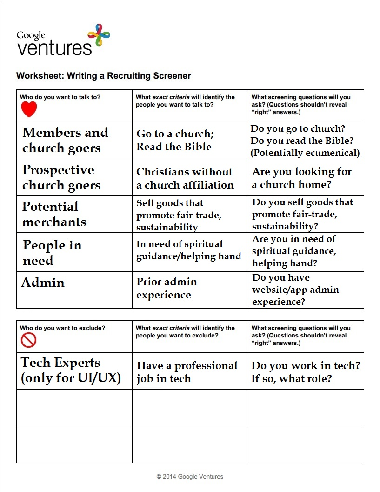
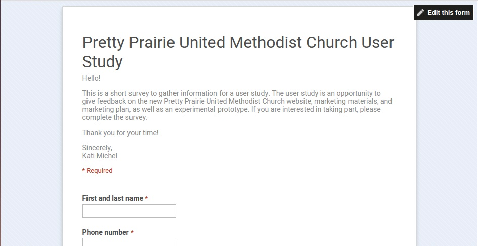
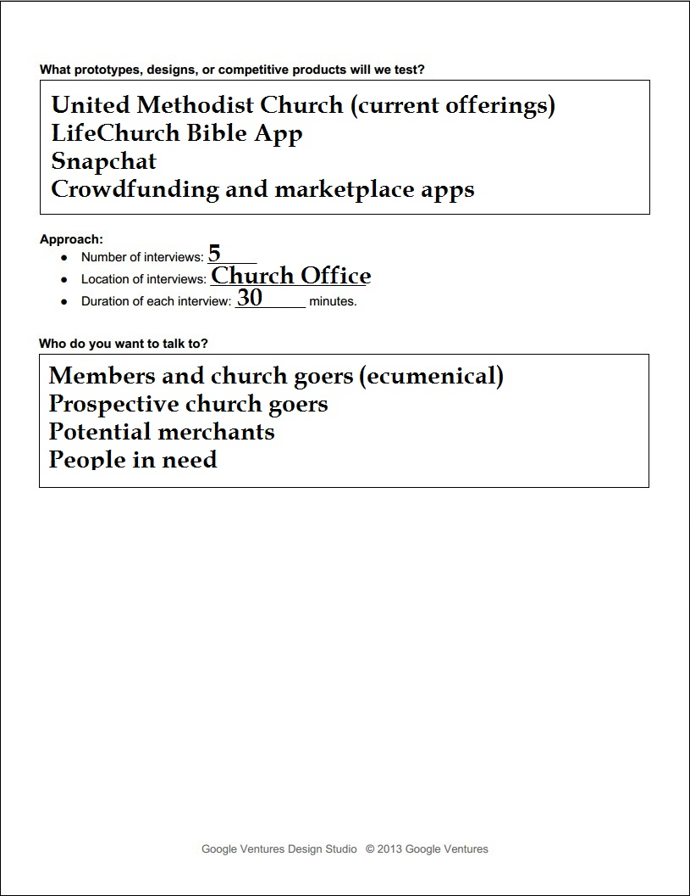
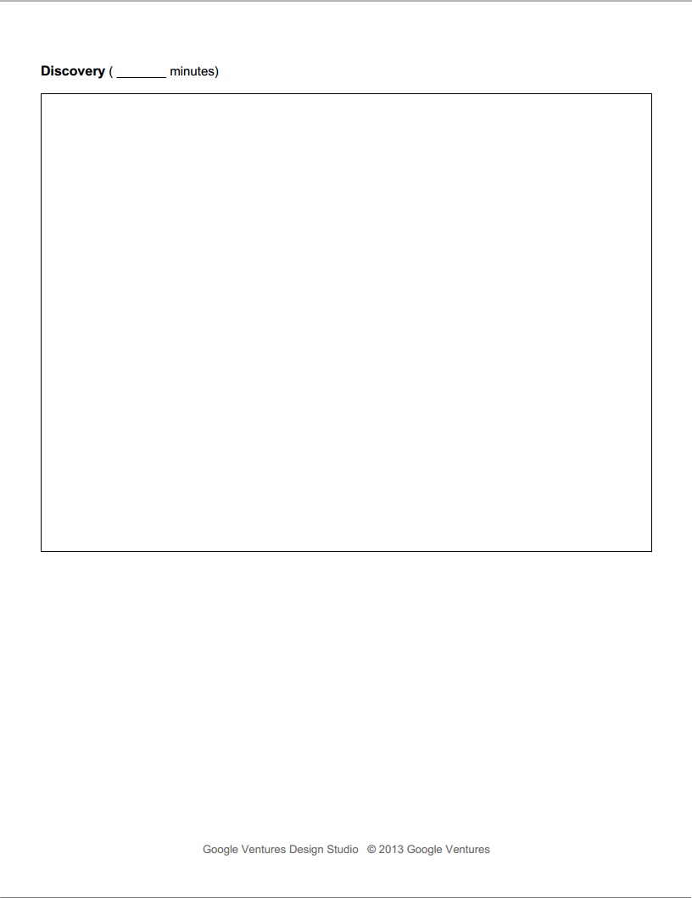
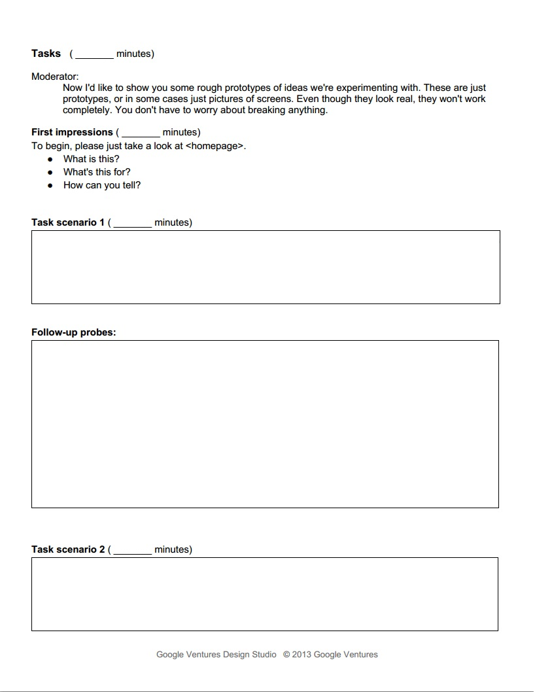
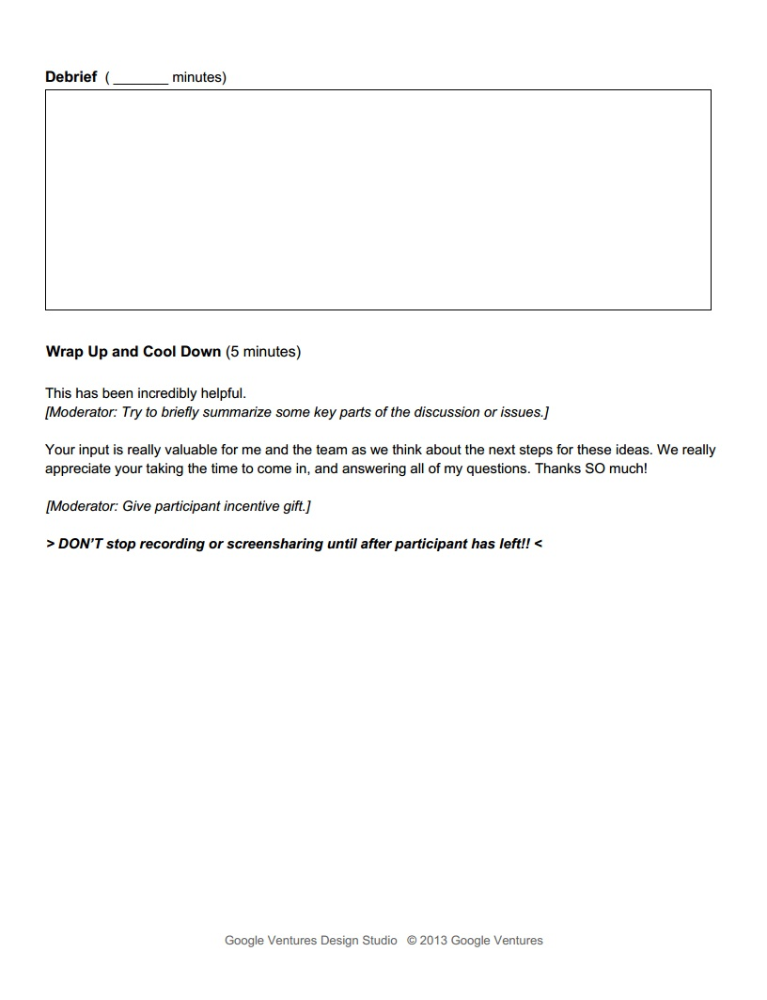
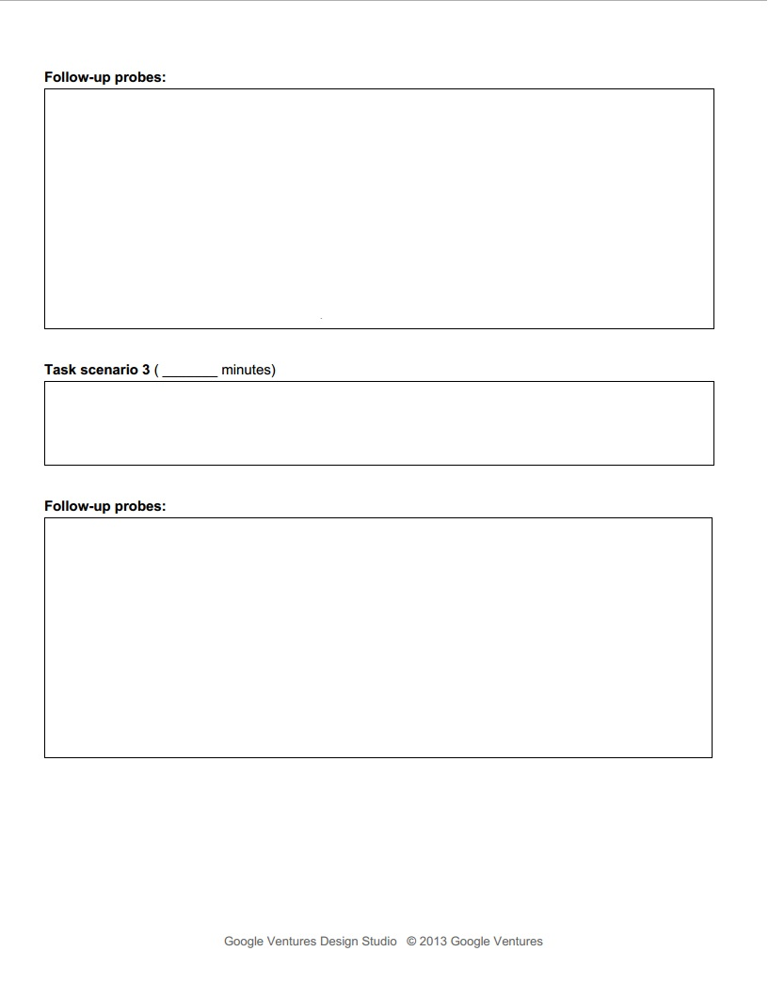
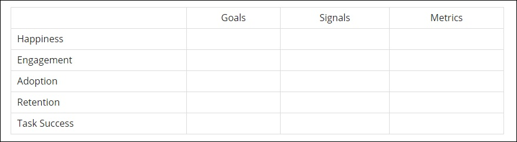

# User Testing

## User Recruiting Process

## Recruiting Screener Worksheet

I filled out the Google Ventures [Recruiting Screener Worksheet](http://www.gv.com/wp-content/uploads/2014/07/Google-Ventures-Research-Sprint-Screener-Worksheet.pdf) to prepare for user recruitment

Favorable user criteria 
* United Methodist Church congregation members
Unfavorable user criteria
* Extremely technical

## Recruiting Screener Ad
Google Ventures often uses a [Craig's List ad](http://www.gv.com/wp-content/uploads/2014/07/Google-Ventures-Research-Sprint-Sample-Craigslist-ad.png) to recruit users. Because members of the United Methodist Church would be the primary users, I sent an email ad to members of the congregation with a link to the [Recruiting Screener](https://docs.google.com/forms/d/16BgZQXq5FDxPuzamTADUWCKCPkizIKzR7now_lNrozM/viewform?usp=send_form). 

Email Ad with link to [Recruitment Screener](https://docs.google.com/forms/d/16BgZQXq5FDxPuzamTADUWCKCPkizIKzR7now_lNrozM/viewform?usp=send_form)

## Recruiting Screener
I used [Google Forms](https://support.google.com/docs/answer/87809?hl=en) to create the [Recruiting Screener](https://docs.google.com/forms/d/16BgZQXq5FDxPuzamTADUWCKCPkizIKzR7now_lNrozM/viewform?usp=send_form). The results were automatically collected in a spreadsheet in Google Drive. 

## Contacting Prospective Users

### Phone Call
After reviewing the Recruiter Screener responses automatically collected in a spreadsheet in Google Drive, I chose prospective user testing participants and called each one to confirm participation. 

### Follow Up Email

After the phone calls, I sent each confirmed participant a follow up email. In each email I included...

I requested that the prospective users reply to confirm. 

Though Google Ventures suggests including in the email a link to a non-disclosure agreement ([Google Ventures Example Non-Disclosure Agreement](http://www.gv.com/wp-content/uploads/2014/07/Google-Ventures-Research-Sprint-Sample-NDA.pdf)), I did not feel that one was needed for this situation. 

## User Interviews

### Interviews

See [Prototype](prototype.md)

### Interview Guide

#### Example Use Case

Information sheet about Dora North Circuit of the United Methodist Church in Mutare District of Zimbabwe, one of the missions of the Pretty Prairie United Methodist Church

### User Testing Summary Report
Concern: that people would use the app instead of going to church and giving money in the offering

## Metrics

### HEART/Goals-Signals-Metrics Framework

Example [HEART/Goals-Signals-Metrics](https://www.gv.com/lib/how-to-choose-the-right-ux-metrics-for-your-product) chart from Google Ventures

