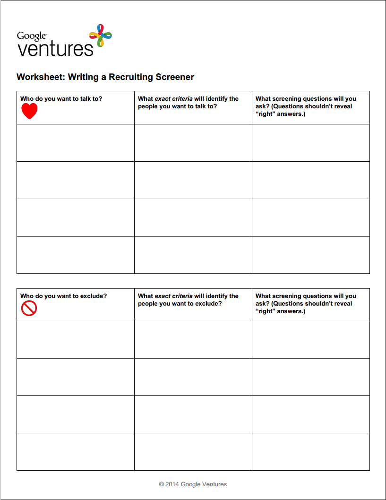

# User Testing

## User Recruiting Process

## Recruiting Screener Worksheet

Favorable user criteria 
* United Methodist Church congregation members

Unfavorable user criteria
* Extremely technical

## Recruiting Screener Ad
Google Ventures often uses a [Craig's List ad](http://www.gv.com/wp-content/uploads/2014/07/Google-Ventures-Research-Sprint-Sample-Craigslist-ad.png) to recruit users. Because members of the United Methodist Church would be the primary users, I sent an email ad to members of the congregation with a link to the recruiting screener. 

## Recruiting Screener
I used [Google Forms](https://support.google.com/docs/answer/87809?hl=en) to create the recruiting screener. The results were automatically collected in a spreadsheet in Google Drive. 

## Contacting Prospective Users

### Phone Call
After choosing user testing participants, I called each one. 

### Follow Up Email

Though Google Ventures suggests including in the email a link to a non-disclosure agreement ([Google Ventures example non-disclosure agreement](http://www.gv.com/wp-content/uploads/2014/07/Google-Ventures-Research-Sprint-Sample-NDA.pdf)), I did not feel that one was needed for this situation. 

In the follow up email, I requested that the prospective users reply to confirm. 

## User Interviews

### Interview Guide

### Interviews
Qualitative and quantitative data

Summary and analysis of findings

### User Testing Summary Report

