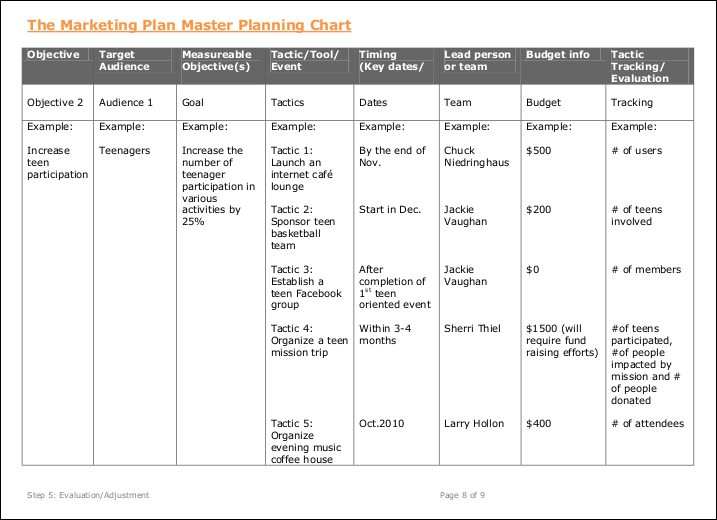
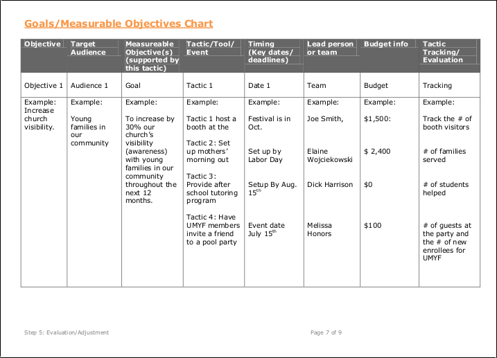

# User Testing

## User Recruiting Process

Recruiting screener worksheet

Favorable user criteria 

Unfavorable user criteria

Email with link to recruiting screener

Recruiting screener

Screener results in Google Drive

Phone call to prospective user

Follow up email with request to prospective user to reply to confirm; If applicable, include a link to a non-disclosure agreement to sign (Google Ventures [example non-disclosure agreement](http://www.gv.com/wp-content/uploads/2014/07/Google-Ventures-Research-Sprint-Sample-NDA.pdf))

Confirmation email

Interview guide

Picture of user study

Summary and analysis of findings

Summary report

## Sample Metrics

Success metrics (ex. [HEART framework](https://www.gv.com/lib/how-to-choose-the-right-ux-metrics-for-your-product))

[Goals-Signals-Metrics process](https://www.gv.com/lib/how-to-choose-the-right-ux-metrics-for-your-product)

The national United Methodist Church suggests using a Goals and Measurable Objectives Chart as part of its Marketing Plan Audit process. 

