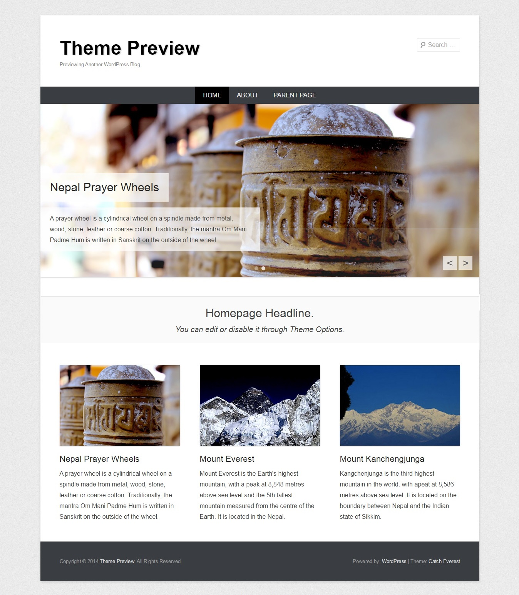
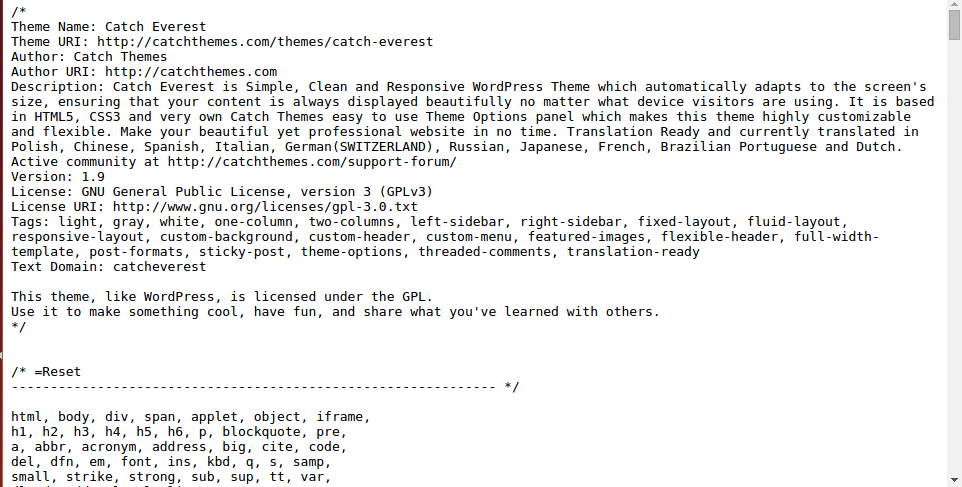
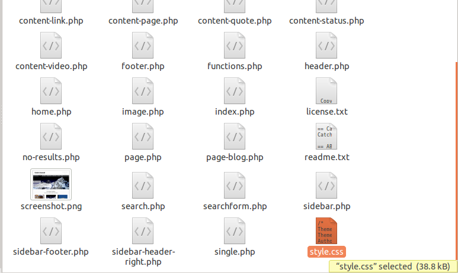
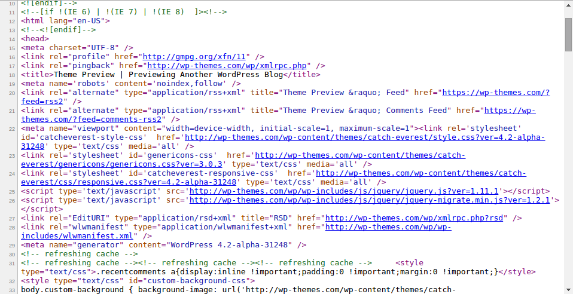
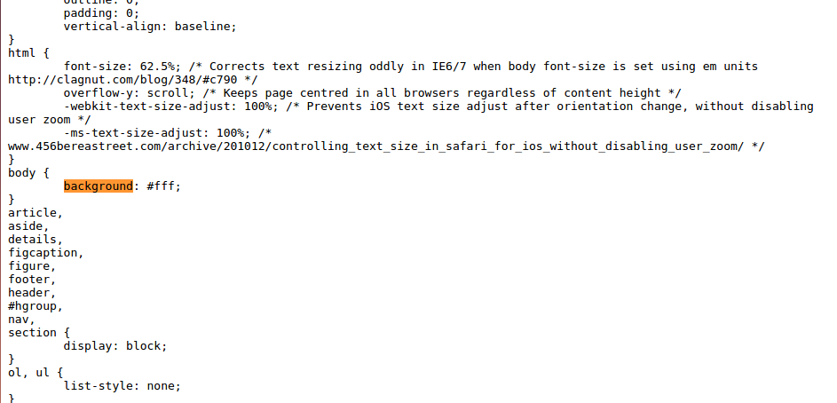
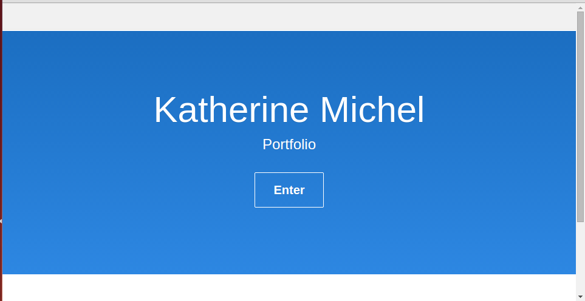
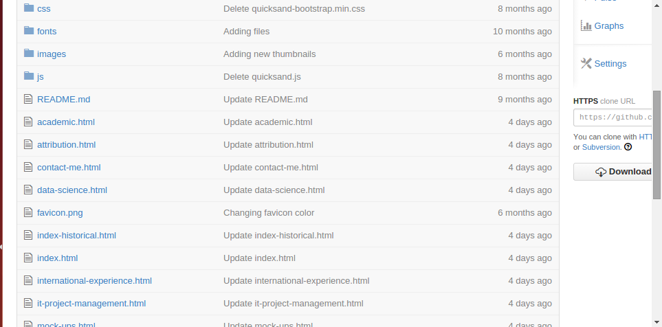
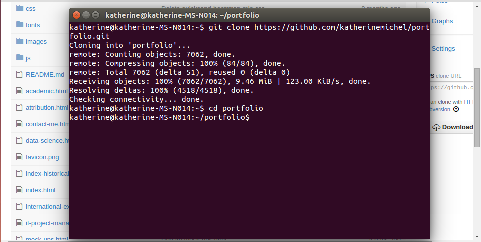

# Web Hosting Primer

### What Does "Making a Website" Mean?

"Making a website" can mean many things. 

"Making a website" can be as simple as using a content management system to "drag and drop" content into pre-determined spaces, without touching the underlying code, but also without much freedom to customize the structure of the website. 

Example: Weebly Drag and Drop Website Builder

Or, "Making a website" can be as sophisticated as assembling all of the underlying code, to create a highly customized website. 

Me using the command line to design a Django Website

But with the freedom to customize comes the risk of "jank."

Many web hosts do offer some middle ground, for instance a content management system that allows for some customization of the [HTML](http://en.wikipedia.org/wiki/HTML) (Hyper Text Markup Language) and/or [CSS](http://en.wikipedia.org/wiki/Cascading_Style_Sheets) (Cascading Style Sheet) code, perhaps without directly touching the code. Here is an example of customizing the CSS of a WordPress theme:

Choose a WordPress theme, for instance [Catch Everest](https://wordpress.org/themes/catch-everest).

Identify the WordPress theme's default [Cascading Style Sheet](http://wp-themes.com/wp-content/themes/catch-everest/style.css?ver=4.0-beta2-20140725) (CSS) code. 

This could be done by downloading the theme files and searching through them...

The CSS could also be found by opening an online [Catch Everest demo](http://wp-themes.com/catch-everest/?TB_iframe=true&width=600&height=400) in the browser, right clicking and choosing "View page source," then looking through the "head" section of the source for a linkn to a CSS file that can be accessed online. 

Determine what aspect of the template's design to change and identify the corresponding CSS code.

Re-write the code to produce the intended change, then enter the altered snippet of code into the designated area of the WordPress content management system that you are using in order to override the default CSS code and make the design change go live.

Another middle ground option is to use a simplified template system to design and deploy your own code (An example is the static portfolio that I made with [Bootstrap](http://getbootstrap.com) then deployed via [GitHub gh-pages](https://github.com/KatherineMichel/portfolio/tree/gh-pages); [Jekyll](http://jekyllrb.com) is another popular option). 

My Portfolio Home Page

The downside of this approach is that it tends to involve interacting directly with the code, perhaps via command line, rather than using the kind of content management system dashboard expected by a client.  

No fancy content management system for my Portfolio. Just code...

and GitHub via my computer command line. 

GitHub offers free hosting on gh-pages. The caveat is that although any sort of code can be stored on GitHub, GitHub gh-pages can only render static content. What does this mean?  

Static content tends to be created using:
* HTML (Hyper Text Markup Language)
* CSS (Cascading Style Sheets)
* JavaScript

By the way, these are the languages associated with "Front End" Web Design. In Web Design and Development, the "Front End" is the part of the website that you can actually see. 

Static content can be rendered in a simpler way than dynamic content. Static content can be rendered by a regular web browser, without the use of a more sophisticated tool called a server. Also, the content of a static page does not change after being rendered by the browser. 

However, there is a limit to the level of scale that can be achieved by simply rendering HTML, CSS, and JavaScript via browser. 

To scale, web developers need to think about "Back End" automation. 

There are a few languages associated with "Back End" automation. 

### Back-End Languages
* Python (Multi-purpose Web Development language with excellent Data Science tools; Currently, the most taught Computer Science language)  
* Ruby (Popular and well-supported)
* PHP (Used in WordPress, and at a few famous companies such as Facebook and Wikipedia, but otherwise, not as well suported as Python and Ruby)
* Node.js (technically not a language)

### Hybrid
* Jekyll (A simplified template system to design and deploy your own code)

### Front-End (What You See) Design
* CSS (Think 10,000 page website and you want to have one place to alter the design of every page at once; That place is the Cascading Style Sheet). 

