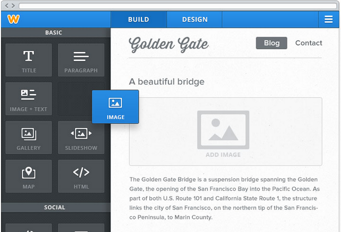

# Web Hosting Primer

### What Does "Making a Website" Mean?

"Making a website" can mean many things. 

"Making a website" can be as simple as using a content management system to "drag and drop" content into pre-determined spaces, without touching the underlying code, but also without much freedom to customize the structure of the website. 

Example: Weebly Drag and Drop Website Builder

"Making a website" can be as intermediate as:

1. Using a content management system that allows for some code customization 

Example: Choose a WordPress template.

Identify the WordPress template's default Cascading Style Sheet (CSS) code.

Determine what aspect of the template's design to change and identify the corresponding code.

Re-write the code then enter the altered snippet of code into the designated area of the WordPress content management system that you are using to override the default CSS code and change the website's design aesthetic.

2. Using a simplified template system to design and deploy your own code (For example, the static portfolio that I made with Bootstrap then deployed via GitHub gh-pages; Jekyll is another popular option)

Or, "Making a website" can be as sophisticated as assembling all of the underlying code, to create a highly customized website. But with the freedom to customize comes the risk of "jank."

Example: Me using the command line to design a Django Website

 

### Front-End Design
* HTML
* CSS (Think 10,000 page website and you want to have one place to alter the design of every page at once; That place is the Cascading Style Sheet). 
* JavaScript

### Back-End Automation
* Python (Multi-purpose Web Development language with excellent Data Science tools; Currently, the most taught Computer Science language)  
* Ruby (Popular and well-supported)
* PHP (Used in WordPress, and at a few famous companies such as Facebook and Wikipedia, but otherwise, not as well suported as Python and Ruby)
* Node.js

### Hybrid
* Jekyll (A simplified template system to design and deploy your own code)

