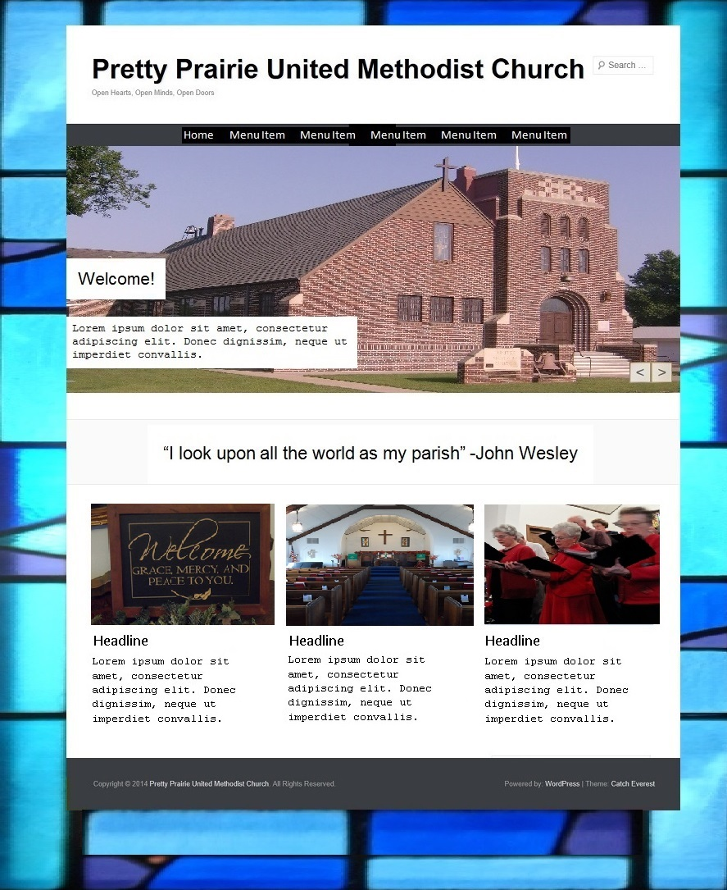
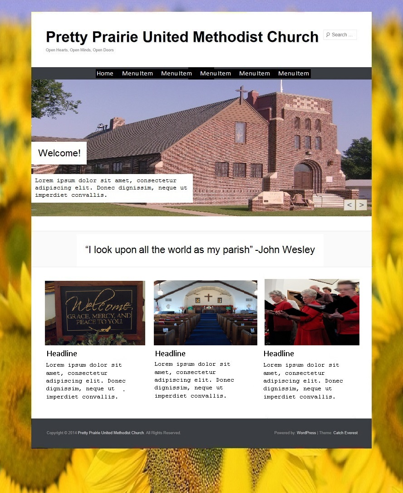

# Website Options

## Website Options Order of Priority

The web options chosen all provided value for money, with the two associated with the United Methodist Church being given first priority.

1. [United Methodist Web Hosting](http://www.umcchurches.org) ([tiers 2 and 3 (now called Silver and Gold](https://umcchurches.org/web-hosting.php), both based on [WordPress](http://en.wikipedia.org/wiki/WordPress))
2. [Ezekial Web Hosting](http://umc.e-zekiel.com) ([discount](http://www.umc.e-zekiel.com/comparison) due to United Methodist partnership)
3. [Squarespace](http://www.squarespace.com) (a [low cost](http://www.squarespace.com/pricing) web host with beautiful, responsive [website templates](http://www.squarespace.com/websites))

## Squarespace

Squarespace was attractive due to:
* Its low price ([$8/month including domain, with year commitment](http://www.squarespace.com/pricing))
* Beautiful, responsive [website templates](http://www.squarespace.com/websites)
* Intuitive content management system 

Final verdict: Squarespace is the web host that I chose for the church. I felt that Squarespace offers the best value for money for Pretty Prairie United Methodist Church's situation. Although Squarespace was $3/month more expensive than the cheapest option (which offered the same/similar templates as one used by a nearby church), the beautiful, modern Squarespace templates would ensure a unique look, and the intuitive content management system could potentially be used by non-techies and occasional volunteers, in order to keep the content relevant. 

Screenshot of finished website: http://www.prettyprairieumc.org 

## United Methodist Church Web Hosting

United Methodist Church Web Hosting was initially attractive due to:
* Its low price ([starting at $5 or less/month](https://umcchurches.org/web-hosting.php))
* Its affiliation with the church, including United Methodist content via RSS widgets
* The user-friendliness of the WordPress content management system 

Stained glass window mockup using [Morgue File photo](http://www.morguefile.com/archive/display/67223)

Stained glass window mockup using pic of Pretty Prairie UMC stained glass window

Sunflowers mockup using [Morgue File photo](http://www.morguefile.com/archive/display/662765)

Final verdict: The United Methodist Web Hosting templates that I liked the best were three very popular and similar looking WordPress templates called [Twenty Eleven](https://wordpress.org/themes/twentyeleven), [Twenty Twelve](https://wordpress.org/themes/twentytwelve), and [Catching Everest](https://wordpress.org/themes/catch-everest). Notably, nearby [New Jerusalem Church](http://prettyprairiechurch.org) is already using one of these templates (the [Twenty Eleven](https://wordpress.org/themes/twentyeleven) theme). Because of this, I decided to forgo the United Methodist Web Hosting in order to have something unique to Pretty Prairie United Methodist Church. 

## Ezekiel 

Ezekiel was initially attractive due to:
* Price ([one time set up fee of $18 + $11/month](http://www.umc.e-zekiel.com/comparison))
* Vast number of [templates](http://www.umc.e-zekiel.com/templates/viewDesigns.asp?)
* Potential for a full-website look (rather than a blog-like appearance)

Pretty Prairie United Methodist Church Ezekiel Home Page Mock Up

Final verdict: I quickly ruled Ezekiel out because I felt its content management system was not intuitive enough to suit the particular needs of Pretty Prairie United Methodist Church. Ezekiel was also a little bit more expensive than the option that I chose. 
