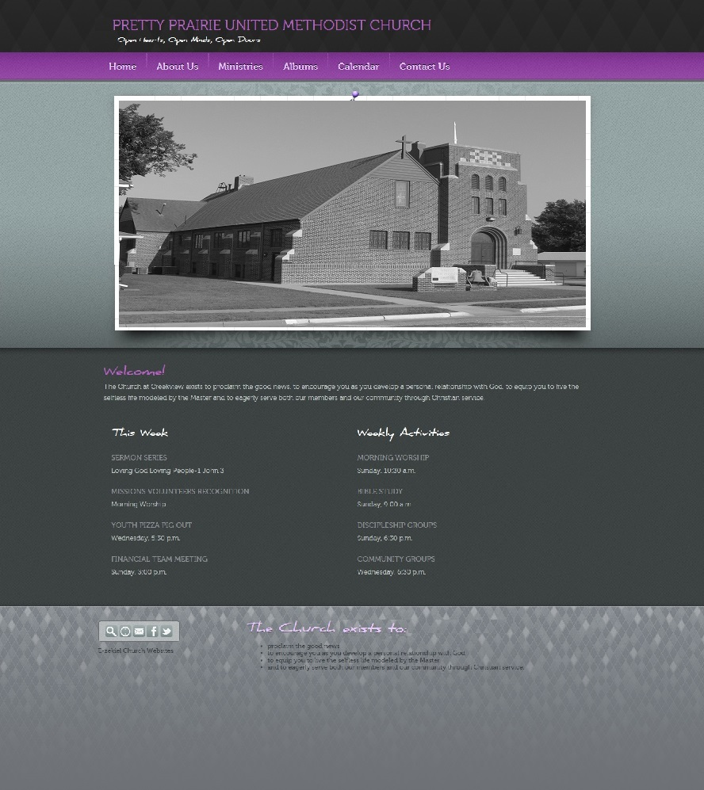

# Website Options

* United Methodist Church Web Hosting
* Ezekiel Web Hosting (discount due to United Methodist partnership)
* Squarespace

First priority was given to the national United Methodist Church's own web hosting platform (which is based on WordPress)

### United Methodist Church Web Hosting

### Ezekiel 
Three things made Ezekiel initially attractive:
* Price ([One time set up fee of $18 + $11/month](http://www.umc.e-zekiel.com/comparison))
* [Vast number of templates](http://www.umc.e-zekiel.com/templates/viewDesigns.asp?)
* Potential for a full-website look (as opposed to the blog-like appearance of WordPress)

Pretty Prairie United Methodist Church Ezekiel Home Page Mock Up

Final verdict: The Ezekiel content management system was not intuitive enough to suit the specific needs of the church. 

