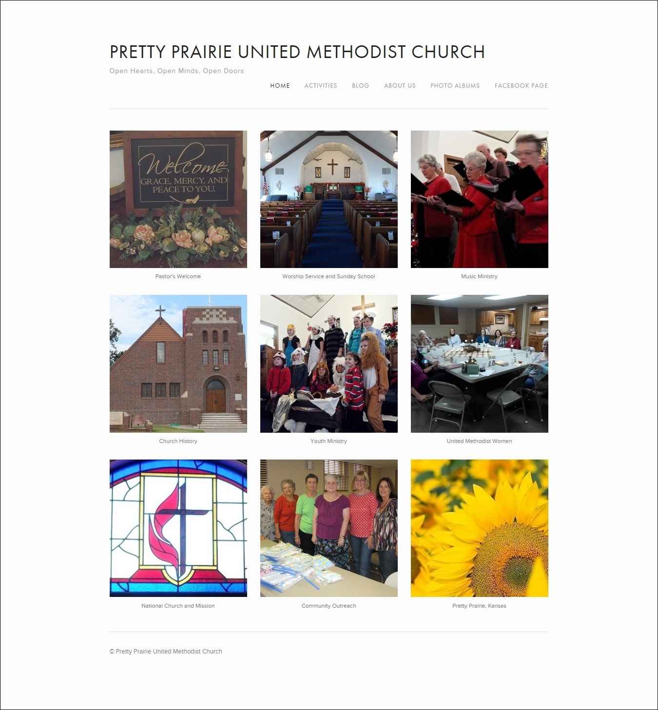

# Website Options

## Website Requirements

## Board Meeting

After presenting my preliminary research and mock ups to the church's Administrative Council, a motion was made that I choose the option that I felt was best.

### Options Matrix 

Board meeting slides

## Website Options Order of Priority

The web options chosen all provided value for money, with the two associated with the United Methodist Church being given first priority.

1. [United Methodist Web Hosting](http://www.umcchurches.org) (tiers 2 and 3, both based on WordPress)
2. [Ezekial Web Hosting](http://umc.e-zekiel.com) (discount due to United Methodist partnership)
3. [Squarespace](http://www.squarespace.com) (a low cost web host with beautiful, responsive [templates](http://www.squarespace.com/templates))

## Squarespace

Squarespace was attractive due to:
* Its low price ([$8/month including domain, with year commitment](http://www.squarespace.com/pricing))
* Beautiful, responsive [templates](http://www.squarespace.com/templates)
* Intuitive content management system 

Final verdict: Squarespace is the web host that I chose for the church. I felt that Squarespace offers the best value for money. Although Squarespace was $3/month more expensive than the cheapest option (which offered the same/similar templates as one used by a nearby church), the beautiful, modern Squarespace templates would ensure a unique look, and the intuitive content management system could potentially be used by non-techies and occasional volunteers, in order to keep the content relevant. 

To find out more and see more of the finished materials, go to [Church Re-Imagined](church_re-imagined.md) :) 

Screenshot of finished website: [www.prettyprairieumc.org](www.prettyprairieumc.org).  

## United Methodist Church Web Hosting

United Methodist Church Web Hosting was initially attractive due to:
* Its low price ([starting at $5 or less/month](http://umcchurches.org/billing/hostingplans.php))
* Its affiliation with the church, including church-related content
* The user-friendliness of the WordPress content management system 

Random Stained Glass Window Mockup

Pretty Prairie UMC Stained Glass Window Mockup

Sunflowers Mockup

Final verdict: The United Methodist Web Hosting templates that I felt were the most modern looking are two very popular and similar looking WordPress templates called [Twenty Eleven](https://wordpress.org/themes/twentyeleven) and [Catching Everest](https://wordpress.org/themes/catch-everest). Notably, (see [Lightning Demos](lightning_demos.md)), nearby New Jerusalem Church is already using the [Twenty Eleven](https://wordpress.org/themes/twentyeleven) theme. Because of this, I decided to forgo the United Methodist Web Hosting in order to have something unique to Pretty Prairie United Methodist Church. 

## Ezekiel 

Ezekiel was initially attractive due to:
* Price ([one time set up fee of $18 + $11/month](http://www.umc.e-zekiel.com/comparison))
* Vast number of [templates](http://www.umc.e-zekiel.com/templates/viewDesigns.asp?)
* Potential for a full-website look (rather than a blog-like appearance)

Pretty Prairie United Methodist Church Ezekiel Home Page Mock Up

Final verdict: I quickly ruled Ezekiel out because I felt its content management system was not intuitive enough to suit the needs of the church. Ezekiel was also a little bit more expensive than the option that I chose. 