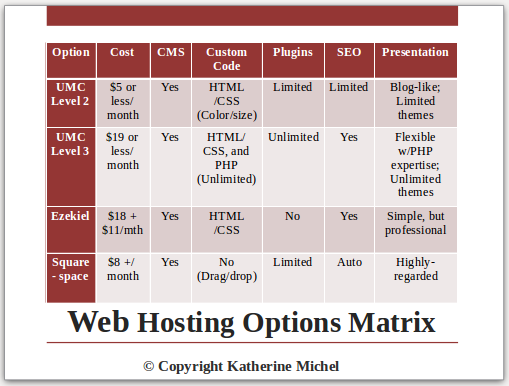
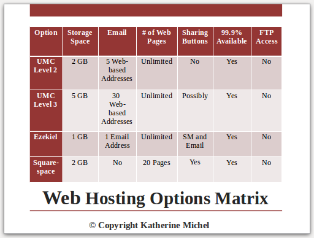

# Website Options

The web options chosen all provided value for money, with the two associated with the United Methodist Church being given first priority.

Order of priority given to web hosting options:

1. United Methodist Web Hosting (Tiers 2 and 3, both based on WordPress)
2. Ezekial Web Hosting (discount due to United Methodist partnership)
3. Squarespace (a low cost web host with beautiful templates)

### Board Meeting Slides- Options Matrix 

### Ezekiel 

Though Ezekiel was initially attractive due to:
* Price ([One time set up fee of $18 + $11/month](http://www.umc.e-zekiel.com/comparison))
* Vast number of [templates](http://www.umc.e-zekiel.com/templates/viewDesigns.asp?)
* Potential for a full-website look (rather than a blog-like appearance)

I quickly ruled Ezekiel out because I felt its content management systen was not intuitive enough to suit the needs of the church.

Pretty Prairie United Methodist Church Ezekiel Home Page Mock Up

### United Methodist Church Web Hosting

Possible Themes: 
* Classic
* Sunflowers
* Staind Glass Window

 

