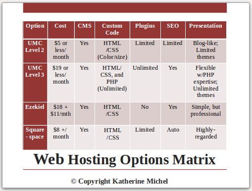
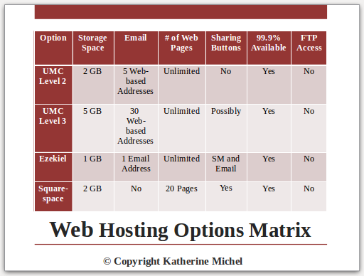
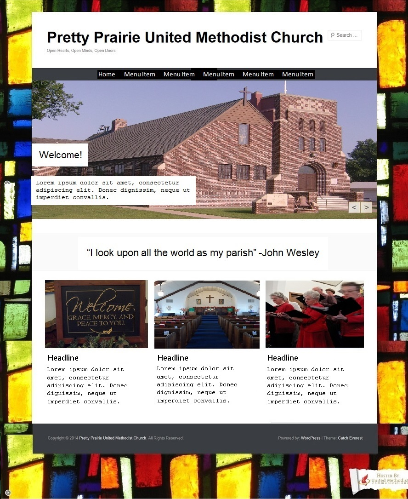
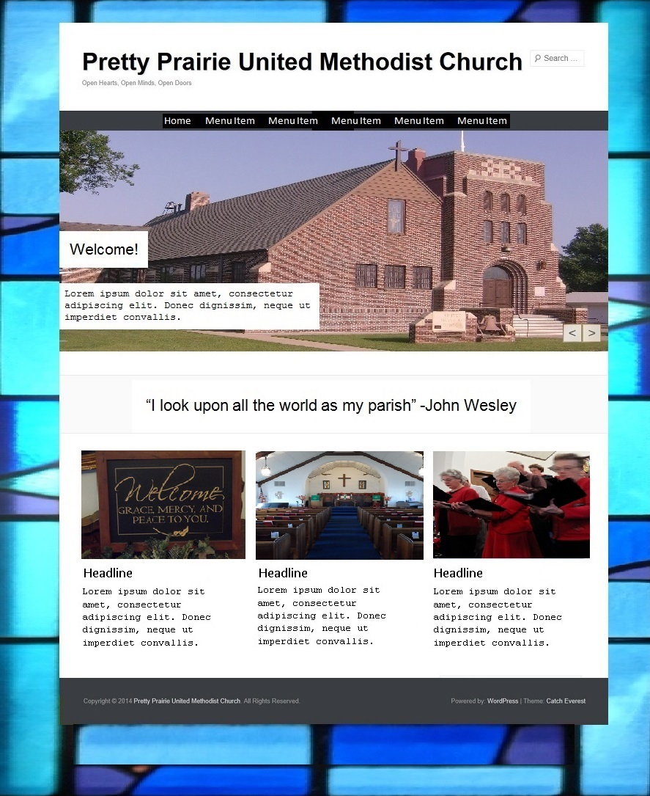
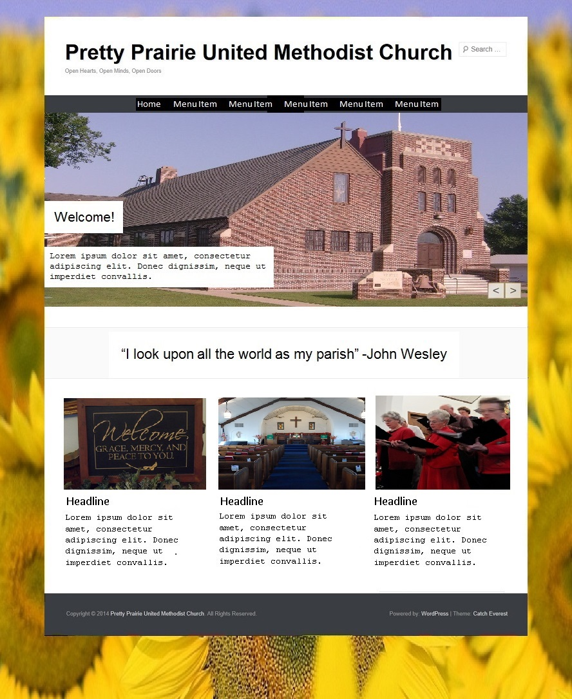
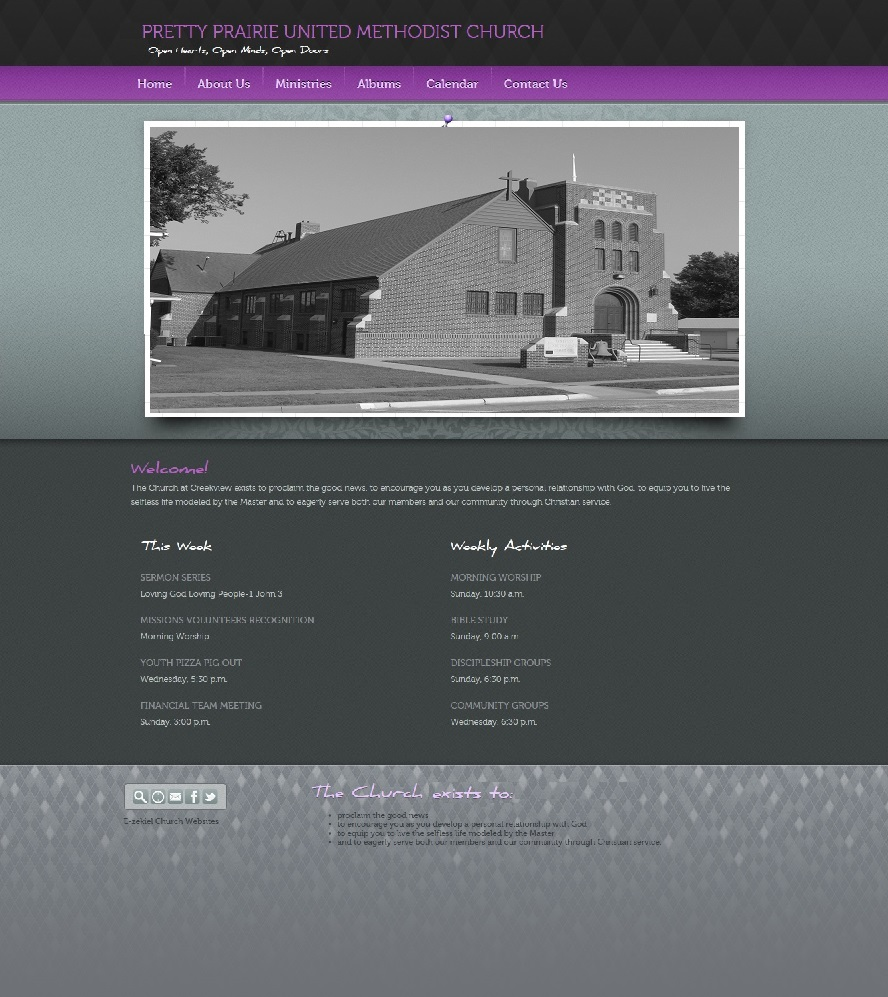

# Website Options

The web options chosen all provided value for money, with the two associated with the United Methodist Church being given first priority.

Order of priority given to web hosting options:

1. [United Methodist Web Hosting](http://www.umcchurches.org) (Tiers 2 and 3, both based on WordPress)
2. [Ezekial Web Hosting](http://umc.e-zekiel.com) (discount due to United Methodist partnership)
3. [Squarespace](http://www.squarespace.com) (a low cost web host with beautiful [templates](http://www.squarespace.com/templates))

### Board Meeting Slides- Options Matrix 

### United Methodist Church Web Hosting

United Methodist Church Web Hosting was initially attractive due to:
* Its low price ([starting at $5 or less/month](http://umcchurches.org/billing/hostingplans.php))
* Its affiliation with the church, including church-related content
* The user-friendliness of the WordPress content management system 

Random Stained Glass Window Mockup

Pretty Prairie UMC Stained Glass Window Mockup

Sunflowers Mockup

Final Verdict: 

### Ezekiel 

Ezekiel was initially attractive due to:
* Price ([One time set up fee of $18 + $11/month](http://www.umc.e-zekiel.com/comparison))
* Vast number of [templates](http://www.umc.e-zekiel.com/templates/viewDesigns.asp?)
* Potential for a full-website look (rather than a blog-like appearance)

Pretty Prairie United Methodist Church Ezekiel Home Page Mock Up

Final Verdict: I quickly ruled Ezekiel out because I felt its content management system was not intuitive enough to suit the needs of the church. Ezekiel was also a little bit more expensive than the option that I chose. 

### Squarespace

Final Verdict: Squarespace is the web host that I chose for the church. I felt that Squarespace offers the best value for money. Squarespace is in the middle pricewise, but still very reasonably priced. The beautiful, modern templates would ensure a unique look, and the intuitive content management system could potentially be used by non-techies and occasional volunteers in order to keep the content relevant.    
